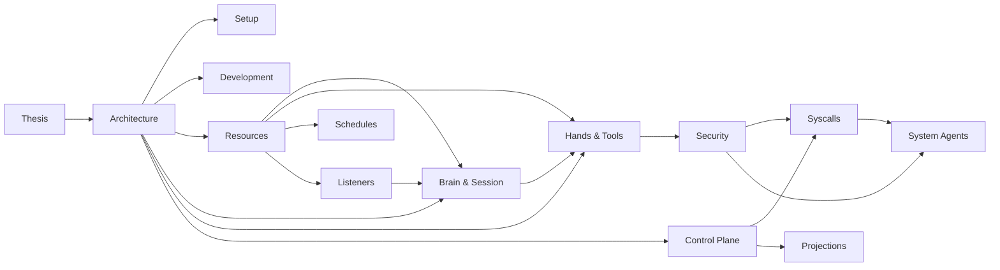

# Hades Documentation

Hades is a Kubernetes-native agent operating system: a small kernel supervises
agent workloads — brains, hands, listeners — as disposable pods, while durable
state (sessions, homes, capabilities) survives every crash.

These docs describe the system as it exists today, verified against the
codebase. Start with the [thesis](thesis.md), then [architecture](architecture.md),
then branch by topic.

## Reading order

1. **[Thesis](thesis.md)** — what Hades is and what it provides.
2. **[Architecture](architecture.md)** — the kernel, the runtime, the privilege ladder, the object graph.
3. **[Setup](setup.md)** — getting started: the offline test path, the kind + Tilt dev loop, brain modes, hands confinement, schedules.
4. **[Install](install.md)** — Helm chart + raw manifests + value overrides.
4. **[Development](development.md)** — KISS/SOLID, ports-and-adapters, the kernel analogy, code style, testing, adding adapters and syscalls.

## Topics

- **[Resources](resources.md)** — the custom resources and their schemas.
- **[Brain and Session](brain-and-session.md)** — brain pods, the durable session log, wake/sleep.
- **[Hands and Tools](hands-and-tools.md)** — hands pods, the sandbox ladder, the brain→hands exec wire.
- **[Listeners](listeners.md)** — per-agent I/O devices and the bridge contract.
- **[Schedules](schedules.md)** — cron/interval/once timers as first-class resources.
- **[Control Plane](control-plane.md)** — the API server, the reconciler, the k8s controller.
- **[Web UI](web-ui.md)** — the React console: agents, activity, easy spin-up.
- **[Security](security.md)** — capabilities, approvals, network policy, credential isolation.
- **[Syscalls](syscalls.md)** — the `os.*` capability-checked syscall surface.
- **[System Agents](system-agents.md)** — provisioner, janitor, auditor.
- **[Projections](projections.md)** — derived views over durable state and events.

## Doc graph

## Conventions

- Every doc is current-state — it describes how the system works now, not design history.
- Mermaid diagrams are committed only after validation.
- Cross-references use relative markdown links; the graph above is the canonical map.
