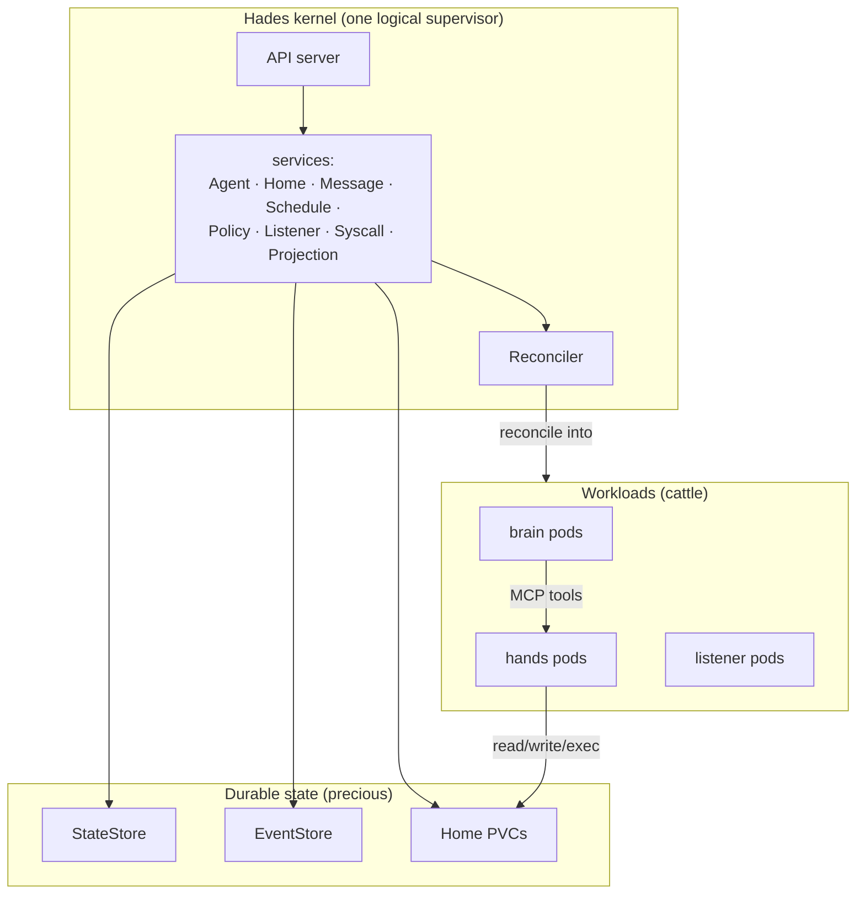
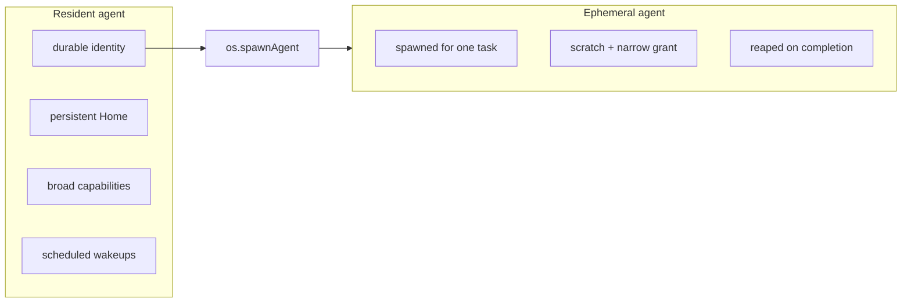
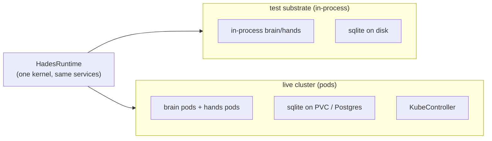
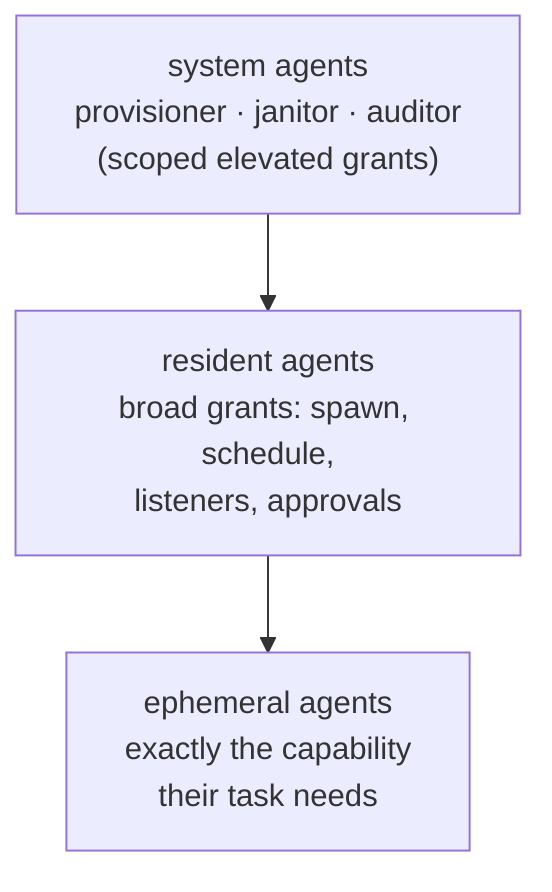

# Hades Architecture

Hades is a **monolithic agent kernel**: one privileged supervisor with internal
subsystems, supervising squishy agent workloads. Think Linux, not a microkernel
that farms every concern out to a separate server.

## The kernel and its workloads

The kernel subsystems (`AgentService`, `HomeService`, `MessageService`,
`ScheduleService`, `PolicyService`, `ListenerService`, `SyscallService`,
`ProjectionService`) live **inside** the kernel — they are internal modules,
not cooperating microservices. The only things that are separate processes are
the squishy workloads: brains, hands, listeners.

## Resident vs ephemeral

| Linux | Hades |
|-------|-------|
| the kernel | the control plane — API, reconciler, policy, stores |
| kernel subsystems (scheduler, fs, net, caps) | Hades services, in-kernel |
| daemons (long-running, privileged) | **resident agents** |
| throwaway processes (short-lived, confined) | **ephemeral agents** |
| syscalls (`fork`, `socket`, `read`) | `os.*` capability-checked syscalls |
| device drivers (loadable modules) | listener bridges (Discord/Matrix/CLI) |
| Linux capabilities + seccomp | the capability/permission system |
| per-process home dir / cgroup | **Home** — persistent agent userland |
| driver code in kernel context | **hands** — the sandbox where untrusted code runs |

## One runtime, swappable adapters

Hades is one k8s-native kernel. There is no "dev mode" or "deploy mode" —
brains and hands are pods. The kernel services depend on **ports**, never on
concrete adapters; the composition root (`createRuntime`) selects which
adapters satisfy the ports. In-process adapters exist only as a test substrate
(they let the kernel run without a cluster); a live cluster injects pod-backed
adapters through the same options.

| Concern | Test substrate | Live cluster |
|---------|----------------|--------------|
| brain | in-process `PiSdkBrainDriver` | `HttpBrainDriver` → brain pod |
| hands | in-process `LocalConfinedHands` | `PodHandsBackend` → exec into hands pod |
| state | `JsonStateStore` | `SqliteStateStore` (Postgres target) |
| events | `JsonlEventStore` | `SqliteEventStore` |
| reconcile | in-process `Reconciler` | + `KubeController` → native k8s objects |

Dev runs the live-cluster path against a local kind cluster via Tilt. The
in-process adapters are test injections, not a runtime variant.

## The privilege ladder

- A **resident agent** you trust runs with broad grants: `os.spawnAgent`,
  `os.attachListener`, `os.createSchedule`, and — if granted — touch the cluster.
- An **ephemeral agent** runs confined: it gets exactly the capability its
  spawning task needs, a scratch workspace, and is reaped on completion.
- A **system agent** (provisioner/janitor/auditor) is a resident agent with an
  elevated but scoped grant — never blanket cluster-admin.

Granting more is a deliberate, inspectable, revocable act recorded in the event
log — the OS-permission primitive.

## Distributed mode

The same kernel services run in both modes behind the same ports:

- **Brain pods** lift the pi-SDK model loop into their own process (`POST /run` + SSE). Tool calls route over **MCP Streamable HTTP** to hands pods.
- **Hands pods** are MCP servers exposing `hades_read`/`hades_write`/`hades_exec`, backed by the same confinement logic. Model credentials never live here.
- **A k8s controller** reconciles Hades resources into native k8s objects: `Deployment`s for brains, `PVC`s for homes, `CronJob`s for schedules, `NetworkPolicy` + `RBAC` for capability projection. Uses `ownerReferences` for native GC.
- **Durable stores**: SQLite-on-PVC event + state stores (behind the port; Postgres is the prod target).
- **Node-count-agnostic**: only standard k8s API objects; single-node k3s → multi-node is a StorageClass swap, never a rewrite.

## System agents

Three privileged userland daemons are bootstrapped on reconcile:
**provisioner** (creates agents/homes/listeners), **janitor** (cleans expired
resources), **auditor** (reviews policy/exposure). They are agents with scoped
capabilities — intelligent operators on top of the deterministic controller.

## Syscalls that are real today

The full `os.*` syscall layer, capability-checked and audited:

- `os.createSchedule` — resident agents set their own timers (cron/interval/once).
- `os.spawnAgent` — a resident agent mints a confined ephemeral worker; the kernel reaps it after. In deploy mode this is a real pod; the controller cascades brain/hands pod deletion.
- `os.createAgent` / `os.createHome` / `os.attachListener` — provision agents, homes, and platform listeners.
- `os.requestApproval` / `os.respondApproval` — resumable human-in-the-loop gates for destructive ops.
- `os.emitArtifact` — record artifact references in the event log.

See [`spec/10-syscalls.md`](../spec/10-syscalls.md).

## Outstanding work

The distributed OS is feature-complete for the credential-free surface.
Remaining work is adapters behind existing ports:

- **Real platform listener bridges**: the CLI bridge is real (`hades attach`); Discord/Matrix/email bridges are declared resources with the routing contract in place, but their platform SDKs are not wired.
- **Live-cluster smoke test**: the controller is tested against a `FakeKubeClient`; the `@kubernetes/client-node`-backed client is wired but not yet exercised against a real cluster.
- **Real model run**: the brain's pi-SDK path is wired but only exercised by an offline test brain. Running a real model depends on your environment's providers/keys.
