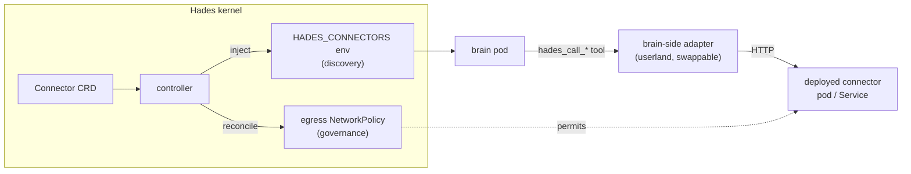

# Connectors

A **Connector** is the kernel's HTTP capability boundary — how an agent reaches
the outside world. The kernel governs the route (NetworkPolicy) and injects
discovery (brain env); the connector itself is **userland**, a deployed HTTP
endpoint the brain calls. The kernel never interprets the body. HTTP is the
unifying standard, like a Linux device driver is a swappable behind a stable
interface.



## The resource

```yaml
apiVersion: hades.dev/v1alpha1
kind: Connector
metadata:
  name: github
  namespace: agent-atlas
spec:
  agentRef: atlas
  endpoint: https://api.github.com      # the userland endpoint
  secretRef: gh-token                    # Secret with auth headers
  egress: restricted-web                 # the granted profile
```

- `endpoint` — an HTTP(S) URL the brain calls. Opaque to the kernel.
- `secretRef` — a k8s Secret whose keys become request headers (auth).
- `egress` — `restricted-web` (grants HTTPS egress) or `none` (no policy).

## What the kernel does

1. **Governance** — `reconcileConnector` ensures a `NetworkPolicy` permitting
   the brain pod egress to the endpoint host over 443. Without the policy the
   pod's default-deny blocks the call at the network layer.
2. **Discovery** — `buildBrain` injects the agent's connectors as a
   `HADES_CONNECTORS` env var (JSON). The brain reads it to know which
   endpoints exist.

## What the kernel does NOT do

It does not call the endpoint, parse the response, or know whether it's a web
fetcher, a GitHub client, or a browser. That is the **brain-side adapter**
(`ConnectorToolRegistrar`, shipped in the brain image) — userland. A user can
swap the adapter (or run none) without touching the kernel, exactly as a Linux
userspace tool talks to a device through a stable syscall.

## Attaching one

```bash
hades apply - <<'EOF'
apiVersion: hades.dev/v1alpha1
kind: Connector
metadata: { name: github, namespace: agent-atlas }
spec: { agentRef: atlas, endpoint: https://api.github.com, secretRef: gh-token, egress: restricted-web }
EOF
```

An agent may also self-attach via the `attachConnector` syscall (gated by a
CapabilityGrant), so it can wire a new endpoint to itself at runtime.

See also: [Security](security.md) (capabilities + egress), [Resources](resources.md).
