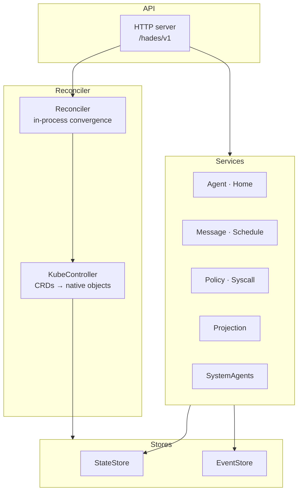
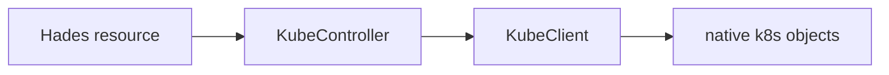

# Control Plane

Hades is a control plane. It owns desired state, lifecycle, routing, policy,
and observability.

## Components



## API server

Stateless HTTP/JSON. Exposes management endpoints, syscall endpoints, and
projection reads. See [`syscalls.md`](syscalls.md) for the syscall
surface and [`projections.md`](projections.md) for read views.

## Reconciler

The in-process reconciler converges desired state. On each `reconcile()` pass:

1. bootstraps system agents (`SystemAgents`)
2. reconciles homes (creates PVCs / layouts)
3. reconciles agents (ensures sessions + brain bindings)
4. reconciles listeners (marks connected / waiting-for-secret)
5. fires due schedules
6. persists state

In distributed mode, a `KubeController` runs after the in-process reconcile
and re-targets the same semantics at the Kubernetes API.

## KubeController

Watches Hades resources and reconciles them into native k8s objects via a
`KubeClient`:



| Hades resource | Native objects |
|----------------|----------------|
| `Home` | `PersistentVolumeClaim` (`home-<name>`) |
| `Agent` (active) | brain `Deployment` + `Service`; model creds from a `Secret` via `envFrom` |
| `Agent` (ephemeral, completed) | cascade-delete brain/hands pods (via `ownerReferences`) |
| `Hands` | hands `Deployment` + `Service` + `NetworkPolicy` (brain→hands only) |
| `Schedule` (cron/interval) | `CronJob` (`sched-<name>`) |
| `CapabilityGrant` | logical policy (NetworkPolicy projection is follow-on work) |

Controllers write `status.phase` back to the resource — `kubectl get agents`
shows phase. `ownerReferences` make garbage collection native k8s: a deleted
agent's brain/hands pods disappear via ownership, not a Hades GC loop.

## Stores

```text
StateStore   json (local) · sqlite-on-PVC (distributed, Postgres target)
EventStore   jsonl (local) · sqlite-on-PVC (distributed)
```

Both are behind ports; swapping the substrate is an adapter change. SQLite on
a PVC is the idiomatic local-k3s store (k3s itself uses SQLite for its control
plane).

## Node-count-agnostic

The controller uses only standard Kubernetes API objects — no `hostPath`, no
bare host processes, no `localhost:` ports, no node pinning. k3s **is**
Kubernetes, so single-node → multi-node is a StorageClass swap, never a code
change.

## See also

- [Architecture](architecture.md) — where the control plane sits in the kernel.
- [Syscalls](syscalls.md) — the API syscall surface.
- [Projections](projections.md) — the read views the API exposes.
- [Resources](resources.md) — what the controller reconciles.
