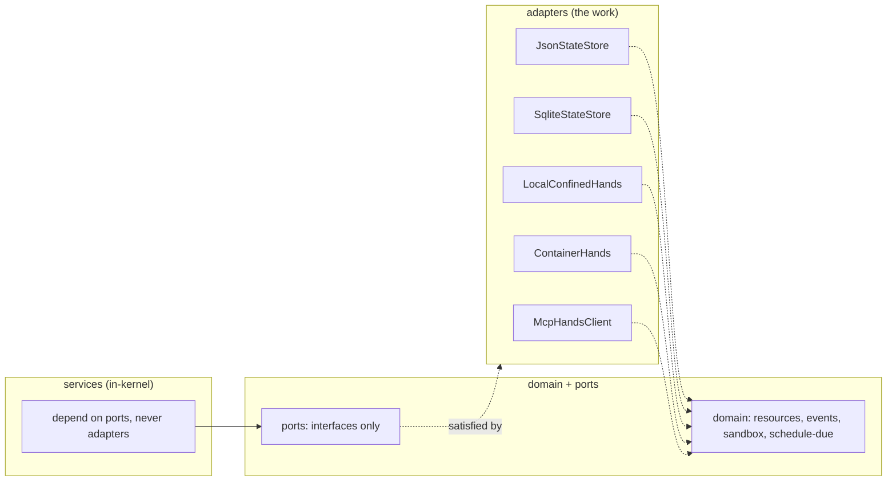
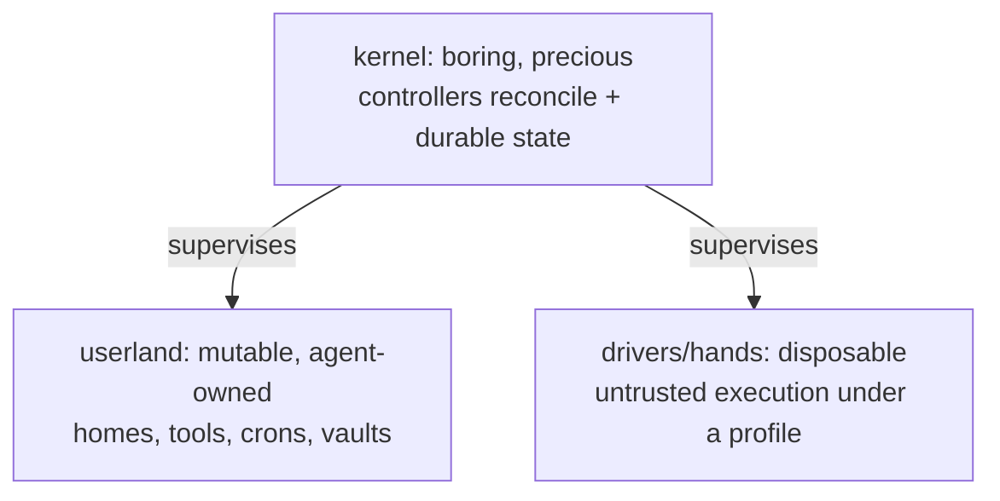

# Development Guide

How to work in the Hades codebase. The rules below keep the kernel boring and
the adapters swappable.

## Principles

### KISS

The kernel is deliberately dull. It does desired-state convergence, routing,
policy, and durability — nothing clever. Intelligence belongs in agents; if a
behavior needs judgment, it is a system agent; if it needs deterministic
convergence, it is a controller. Never put cleverness in the kernel path.

### SOLID

- **Single responsibility** — each service owns one concern: `AgentService`
  mints agents, `HomeService` mints homes, `ScheduleService` fires timers.
  `SyscallService` checks capabilities; it does not also reconcile.
- **Open/closed** — new substrates are added by writing a new adapter behind
  an existing port, not by editing services. Adding `ContainerHands` did not
  touch `BrainService`.
- **Liskov** — every `HandsBackend` is substitutable for every other.
  `LocalConfinedHands`, `ContainerHands`, `McpHandsClient`, `HttpHandsClient`
  all satisfy the same interface with different isolation.
- **Interface segregation** — ports are small and focused: `EventStorePort`,
  `StateStorePort`, `BrainDriver`, `HandsBackend`, `KubeClient`,
  `ListenerBridge`, `HandsResolver`, `PolicyPort`. No fat god-interfaces.
- **Dependency inversion** — services depend on ports, never on concrete
  adapters. `createRuntime` wires concrete adapters *into* the ports; services
  never import an adapter.

### Ports and adapters (hexagonal)

The runtime (`LocalRuntime` / `DistributedRuntime`) is the **composition root**:
the only place that knows which concrete adapters satisfy which ports. Services
and domain code import only ports and other services. This is what lets the two
runtimes share one kernel — the seam is the port, not a config flag.

## The kernel analogy as engineering principle

Hades models itself on a Unix kernel. This is not aesthetic — it is the
load-bearing design:

- **Only the kernel and durable state are precious.** Brains, hands, and
  listeners are cattle — killed freely, re-created from the durable log.
- **The brain is never inside the sandbox.** The model loop and the untrusted
  execution boundary are different pods. This is the credential-isolation
  invariant.
- **Self-modification is a syscall, not a privilege.** Agents grow their
  userland through capability-checked `os.*` calls — never by patching kernel
  YAML directly.

When in doubt about where a behavior goes, ask: is this precious kernel state,
mutable userland, or disposable execution? That triage determines the layer.

## Code style

- **TypeScript, ESM, strict.** Node 24+.
- **Indentation: 4 spaces, never tabs.**
- **Imports:** type-only imports use `import type`. Path imports carry the
  `.js` extension (ESM output).
- **One concern per file.** A service = one file; an adapter = one file.
- **No magic.** Prefer an explicit condition over a clever shortcut. The
  reconcile loop is a flat `for` over resources, not a clever graph walk.
- **Comments explain *why*, not *what*.** The code shows what; the comment
  shows the invariant or the constraint that motivated it.
- **Doc comments** (`/** */`) on every exported class and public function:
  what it is, what invariant it upholds, and (if non-obvious) how it fits the
  ports-and-adapters shape.

## Testing

- Tests are plain `node:test` (no framework). Each file is self-contained and
  builds its own fixture.
- The dev runtime (`createRuntime`) is the test substrate. Tests never touch a
  real cluster — `FakeKubeClient` stands in for the `KubeController`.
- **Never break the dev runtime.** It is the asset; the distributed runtime is
  the same kernel with pod-backed adapters. If a test breaks the local path,
  the kernel is wrong, not the test.
- Container-hands tests gate on `docker info`; they prove real isolation without
  requiring a daemon in CI.
- Run: `npm test` (builds then `node --test`).

## Adding a new adapter

1. Find the port it satisfies (`HandsBackend`, `EventStorePort`, `KubeClient`…).
2. Implement the port in `src/adapters/...`. Do not edit any service.
3. Wire it at the composition root: `createRuntime` (local) and/or
   `createDistributedRuntime` (deploy).
4. Add a test that exercises it through the port, not through the adapter's
   internals.

If you find yourself editing a service to support a new substrate, the port is
wrong — widen the port, don't special-case the service.

## Adding a new syscall

1. Add the capability to the `CAPABILITIES` catalog in `SyscallService`.
2. Implement the method on `SyscallService`: resolve subject → assert
   capability → validate namespace → write resource + audit event.
3. Expose it on the API in `src/adapters/api/server.ts`.
4. Test it through the API or the `Runtime.syscalls` surface.

Every syscall is audited (`syscall.audited`) and namespace-confined. There is
no privileged back door.

## Concurrency notes

- `spawnAgent` has a check-then-apply on the agent name. This is acceptable for
  a personal agent OS where callers choose names; if contention becomes real,
  gate it behind an idempotency key rather than a lock.
- Schedule firing claims the occurrence synchronously before the await, so
  concurrent reconciles cannot double-fire.
- `StateStore.save()` is the durability boundary. Services mutate the
  in-memory state mirror and call `save()` to persist; the reconcile loop
  saves once at the end of a pass.
