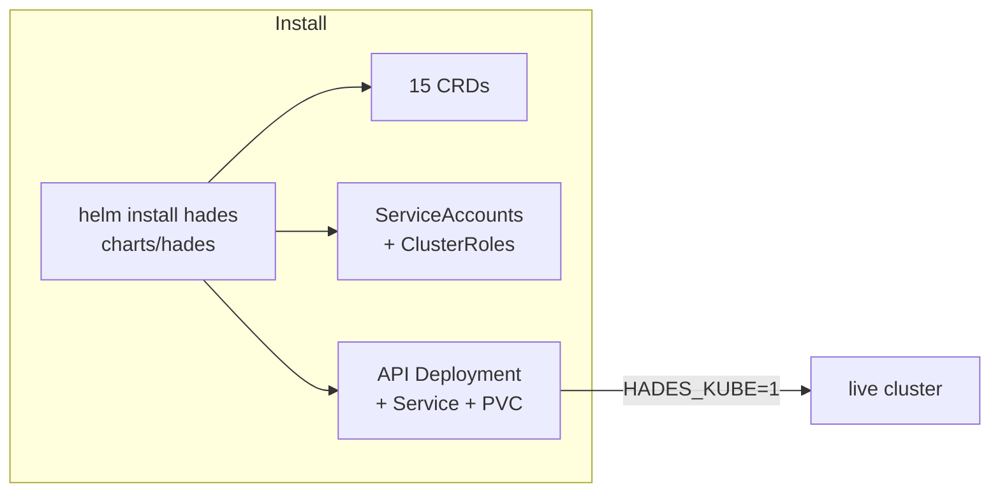

# Install

Hades runs as native Kubernetes resources. There are two install paths:



## Helm (recommended)

```bash
helm install hades ./charts/hades --namespace hades-system --create-namespace
```

This installs the 15 CRDs, the controller/API `ServiceAccount` + `ClusterRole`s,
the brain-pod exec `ServiceAccount`, the data `PersistentVolumeClaim`, and the
`hades-api` `Deployment` + `Service`. The API serves the web UI at `/` when the
image is built with it (see [Dockerfile.api](../infra/docker/Dockerfile.api)).

Common value overrides (`--set` or a `values.yaml`):

| Value | Default | Purpose |
|---|---|---|
| `image.repository` / `image.tag` | `hades-api` / `latest` | control-plane image |
| `image.pullPolicy` | `Never` | `IfNotPresent` for a real registry |
| `api.replicas` | `1` | control-plane replicas |
| `api.storage.size` | `1Gi` | durable-state PVC |
| `api.storage.storageClassName` | unset (cluster default) | shared class for multi-node |
| `brainImage.*` / `handsImage.*` | `hades-brain` / `node:24-slim` | per-agent pod images |

For multi-node clusters, set `api.storage.storageClassName` to a shared class
(longhorn / nfs / cephfs) so the brain pod can reattach its home anywhere.

## Raw manifests

The same resources live as plain YAML under `infra/k8s/` for `kubectl apply`:

```bash
kubectl apply -f infra/k8s/namespace-rbac.yaml
kubectl apply -f infra/k8s/crds/
kubectl apply -f infra/k8s/api.yaml
```

## Dev loop (kind + Tilt)

For development, `tilt up` builds the images, loads them into a kind cluster,
and port-forwards the API to `:7347`. See [Setup](setup.md).

See also: [Control Plane](control-plane.md), [Web UI](web-ui.md).
