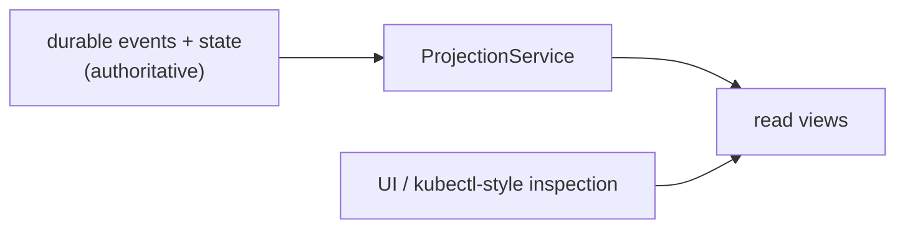

# Projections

Projections are derived views over durable state and events. They exist so the
UI and inspection tools don't replay every raw event on every read. Raw events
remain authoritative; projections are caches.

## The model



Today `ProjectionService` reads synchronously over the in-memory state mirror
+ event log (always fresh, cheap). A background projection store maintained on
event subscribe is the production target; the query surface is stable either
way.

## Views

| View | Description |
|------|-------------|
| `agentTree` | Every agent with its phase, lifecycle, brain pod, session, system-agent flag. |
| `activityTail` | The last N events across all (or one) session, with summaries. |
| `runSummaries` | Completed runs with their outcome. |
| `approvalQueue` | Pending approvals awaiting human response. |
| `scheduleStatus` | Every schedule with its phase and last fire. |
| `listenerStatus` | Every listener with its platform and phase. |
| `snapshot` | The full control-room view: agents, runs, approvals, schedules, listeners, recent activity. |

## API endpoints

```text
GET /hades/v1/projections/agents?namespace=
GET /hades/v1/projections/activity?session=&limit=
GET /hades/v1/projections/approvals?namespace=
GET /hades/v1/projections/schedules?namespace=
GET /hades/v1/projections/listeners?namespace=
GET /hades/v1/projections/snapshot?namespace=
```

## Activity summaries

Each event type has a human-readable summary produced by the projection layer:

```text
listener.message.received   message from <platform>
brain.woke                  brain woke (<mode>)
home.file.written           wrote <path>
tool.completed              tool <tool>
schedule.fired              schedule <schedule>
agent.spawned               spawned <agent>
approval.requested          approval <name> (<action>)
syscall.audited             <who> -> <capability>
```

Raw events stay queryable via `GET /hades/v1/events?session=`; projections are
the pre-computed convenience layer on top.

## See also

- [Control Plane](control-plane.md) — the API server that exposes projection reads.
- [Brain and Session](brain-and-session.md) — the durable events projections are derived from.
