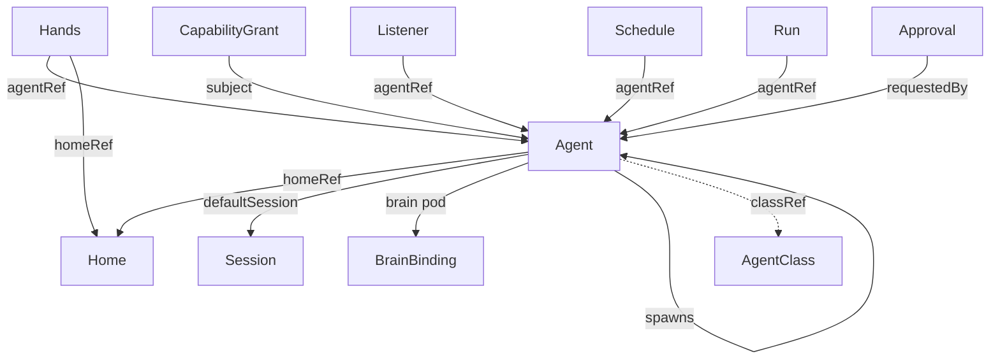

# Resources

Hades resources are Kubernetes custom resources (`hades.dev/v1alpha1`). They are
visible through `kubectl`, reconciled by the controller, and backed by normal
cluster primitives. The CRD schemas use
`x-kubernetes-preserve-unknown-fields: true` today; tightening to validated
schemas is tracked work.

## Resource kinds



| Kind | Purpose |
|------|---------|
| `Agent` | A durable identity and policy domain. Resident or ephemeral. |
| `AgentClass` | A reusable template (brain image, allowed tools, hands policy). |
| `Home` | A persistent userland filesystem (mounted as a PVC). |
| `Session` | The append-only event log for one conversation. |
| `BrainBinding` | Status-only: the brain pod bound to a session. |
| `Hands` | A hands pod spec (image, homeRef, isolation). |
| `Listener` | A per-agent I/O device (Discord/Matrix/email/CLI). |
| `Schedule` | A timer (cron/interval/once) that fires a prompt. |
| `Run` | A bounded unit of work in a session. |
| `Approval` | A resumable human-in-the-loop gate. |
| `CapabilityGrant` | Capabilities granted to a subject, with constraints. |

## Agent

```yaml
apiVersion: hades.dev/v1alpha1
kind: Agent
metadata:
  name: atlas
  namespace: agent-atlas
spec:
  displayName: Atlas
  classRef: resident-pi
  homeRef: atlas-home
  defaultSession: atlas-default
  desiredState: active        # active | inactive
  lifecycle: resident         # resident | ephemeral
  brain:
    mode: pi-sdk              # pi-sdk | test
    image: ghcr.io/hades-dev/hades-brain:dev
    secretRef: atlas-model-creds
status:
  phase: active
  brainPod: brain-atlas
  session: atlas-default
```

`lifecycle: ephemeral` agents are spawned by `os.spawnAgent`, run once, then
reaped (`phase: completed`). The controller cascades brain/hands pod deletion.

## Home

```yaml
apiVersion: hades.dev/v1alpha1
kind: Home
metadata:
  name: atlas-home
  namespace: agent-atlas
spec:
  size: 1Gi                  # PVC request
  layout:
    create: [vault, bin, cron.d, projects, skills, inbox, outbox]
  files:
    - path: vault/README.md
      content: "# Atlas's userland"
status:
  phase: ready
  pvc: home-atlas-home
```

The Home is mutable agent-owned userland. The kernel provisions the PVC and
bootstrap layout; it does not dictate content. Kernel credentials are never
stored here.

## Listener

```yaml
apiVersion: hades.dev/v1alpha1
kind: Listener
metadata:
  name: atlas-discord
  namespace: agent-atlas
spec:
  agentRef: atlas
  platform: discord           # cli | discord | matrix | email | web
  secretRef: atlas-discord-token
status:
  phase: connected
```

The `cli` platform is backed by the real `CliBridge` (`hades attach`). Discord /
Matrix / email are declared resources whose platform SDKs are not wired — they
fail loudly on start until the bridge adapter is added.

## Schedule

```yaml
apiVersion: hades.dev/v1alpha1
kind: Schedule
metadata:
  name: morning-ritual
  namespace: agent-atlas
spec:
  agentRef: atlas
  type: cron                  # cron | interval | once
  schedule: "0 7 * * *"      # 5-field Vixie cron, or +Ns/m/h
  session: atlas-default
  prompt: "Good morning. Orient and say hello."
status:
  phase: active
  lastFiredAt: "2026-06-26T07:00:00Z"
```

## CapabilityGrant

```yaml
apiVersion: hades.dev/v1alpha1
kind: CapabilityGrant
metadata:
  name: atlas-self-management
  namespace: agent-atlas
spec:
  subject:
    kind: Agent
    name: atlas
  capabilities:
    - createOwnSchedule
    - spawnAgent
    - createHome
    - emitArtifact
  constraints:
    namespace: own            # may only act in own namespace
status:
  phase: active
```

Capabilities are typed permissions above raw Kubernetes RBAC. The full catalog
is in [`syscalls.md`](syscalls.md).

## Approval

```yaml
apiVersion: hades.dev/v1alpha1
kind: Approval
metadata:
  name: deploy-prod
  namespace: agent-atlas
spec:
  requestedBy: atlas
  action: deploy
  reason: "ship the morning brief"
  resource: "deployment/morning-api"
  expiresIn: 1h
status:
  phase: requested           # requested | approved | denied | expired
  createdAt: "2026-06-26T07:15:00Z"
```

## Namespaces

```text
hades-system       the kernel + system agents (provisioner/janitor/auditor)
agent-atlas         Atlas's agents, homes, listeners, schedules
project-* / team-*  per-project agent namespaces (multi-tenant)
```

System agents live in `hades-system` with scoped grants. Ordinary agents live
in their own namespace and cannot, by default, target another namespace.

## See also

- [Brain and Session](brain-and-session.md) — the `Agent`, `Session`, `BrainBinding` resources in motion.
- [Hands and Tools](hands-and-tools.md) — the `Hands` resource and the sandbox.
- [Schedules](schedules.md) — the `Schedule` resource.
- [Syscalls](syscalls.md) — the capability catalog behind `CapabilityGrant`.
