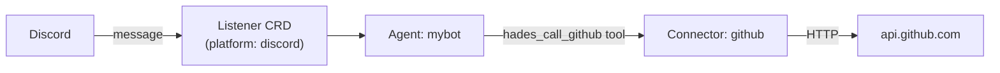

# Tutorial 02 — A Discord bot agent

Goal: a resident agent attached to Discord, able to call out over HTTP via a
Connector. Builds on [01 — Install on kind](01-install-on-kind.md); assumes a
running Hades cluster with the API port-forwarded to `:7347`. ~10 minutes.

## 1. What you'll build



A Discord message reaches the agent via a `Listener`; the agent can call GitHub
via a `Connector` whose egress the kernel governs (NetworkPolicy) and whose
endpoint it discovers (env). The kernel never interprets either body.

## 2. Create the agent namespace + brain SA

```bash
kubectl create namespace agent-mybot
kubectl -n agent-mybot create serviceaccount hades-brain
kubectl -n agent-mybot create rolebinding hades-brain \
    --clusterrole=hades-brain --serviceaccount=agent-mybot:hades-brain
```

## 3. Create the Discord token Secret

The `discord-bot` template references a Secret by name. Create it with your bot
token (get one from the Discord Developer Portal):

```bash
kubectl -n agent-mybot create secret generic mybot-discord-token \
    --from-literal=token=YOUR_BOT_TOKEN_HERE
```

## 4. Spin up the agent from the template

`hades new` renders Home + Agent + Listener + CapabilityGrant from
`examples/templates/discord-bot.yaml`, substituting your name + vars:

```bash
# Set HADES_DATA_DIR + HADES_KUBE so the CLI talks to the cluster.
# (In a real deploy you'd run `hades new` inside the control-plane pod, or
#  hit the template API. Here we use the API for portability.)
curl -s -X POST http://127.0.0.1:7347/hades/v1/templates/discord-bot/apply \
    -H 'content-type: application/json' \
    -d '{"name":"mybot","namespace":"agent-mybot","vars":{"token-secret":"mybot-discord-token"}}' | jq '.applied'
```

Expected: `4` (Home, Agent, Listener, CapabilityGrant).

The listener starts as `phase: connected` once the controller resolves the
Secret. Confirm:

```bash
curl -s "http://127.0.0.1:7347/hades/v1/agents?namespace=agent-mybot" | jq '.[].status'
```

## 5. Attach a Connector (outbound HTTP)

Give the agent an outbound capability — a GitHub endpoint it may call. The
kernel governs egress (a NetworkPolicy permitting HTTPS to the host) and
injects discovery (the `HADES_CONNECTORS` env the brain reads).

Create a Secret with the auth header, then the Connector:

```bash
kubectl -n agent-mybot create secret generic gh-token \
    --from-literal=Authorization='Bearer YOUR_GITHUB_TOKEN'

curl -s -X POST http://127.0.0.1:7347/hades/v1/resources \
    -H 'content-type: application/json' \
    -d '{"apiVersion":"hades.dev/v1alpha1","kind":"Connector","metadata":{"namespace":"agent-mybot","name":"github"},"spec":{"agentRef":"mybot","endpoint":"https://api.github.com","secretRef":"gh-token","egress":"restricted-web"}}' >/dev/null

curl -s -X POST http://127.0.0.1:7347/hades/v1/reconcile >/dev/null
```

Confirm the brain pod received the connector as env:

```bash
kubectl -n agent-mybot get deploy brain-mybot -o jsonpath='{.spec.template.spec.containers[0].env[?(@.name=="HADES_CONNECTORS")].value}' | jq .
```

Expected: a JSON array with the `github` connector (name, endpoint, secretRef).

## 6. Talk to the bot

DM your Discord bot. With `brain.mode: pi-sdk`, the agent runs a real model
loop (needs a working model provider in your environment — see
[Setup](../setup.md)). The brain routes `hades_call_github` through the
connector when the model invokes it.

For an offline smoke test (no model), recreate the agent with
`brain.mode: "test"` and drive it directly:

```bash
curl -s -X POST http://127.0.0.1:7347/hades/v1/agents/mybot/message \
    -H 'content-type: application/json' \
    -d '{"namespace":"agent-mybot","text":"hello"}' | jq -r .reply
```

Expected: `mybot received: hello` (the test brain echoes).

## What you've seen

- A `Listener` is an inbound I/O device; the kernel marks it connected once
  the Secret resolves.
- A `Connector` is the outbound capability boundary: the kernel governs
  (NetworkPolicy) + discovers (env) + routes; the brain-side adapter does the
  HTTP call.
- Templates compose several resources in one `hades new`.

Next: **[03 — A custom Nix hands image](03-custom-hands-image.md)**.

---

*The kernel never sees your Discord token or GitHub token as plaintext — they
live in k8s Secrets injected as env/headers. See [Security](../security.md).*
