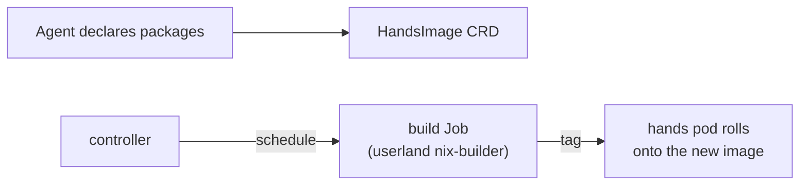

# Tutorial 03 — A custom Nix hands image

Goal: give an agent its own packages (a custom toolset) via a declarative
`HandsImage`, so its hands pod runs the agent's own image — without touching
the host. Builds on [01](01-install-on-kind.md). ~10 minutes.

## 1. Why

Each agent's hands pod is a sandbox the brain execs into. By default it's
`node:24-slim`; an agent that needs `ripgrep`, `jq`, `python`, or its own tools
declares them as a `HandsImage`. The kernel schedules an idempotent build `Job`
(a userland nix-builder image) that materializes the declaration into an image
tag; the hands pod rolls onto it. The agent owns its packages declaratively,
like a `shell.nix` — the kernel only governs the build.



## 2. Prerequisites

Same cluster as [01](01-install-on-kind.md), API on `:7347`, an agent in
`agent-demo` named `demo`. You'll also need a nix-builder image loaded into
kind (the default builder is `hades-nix-builder:latest` — for this tutorial we
point at a real builder image you build):

```bash
# A minimal nix-builder image (overrides the default). In production this is a
# fixed image the kernel routes to; here we use nixpkgs#nix as a stand-in.
docker build -t hades-nix-builder:latest - <<'EOF'
FROM nixos/nix:latest
RUN echo "buildPhase placeholder" >/dev/null
EOF
kind load docker-image hades-nix-builder:latest --name hades
```

> The builder image is **userland** — swappable. The kernel only schedules the
> build Job; it never runs nix itself.

## 3. Install packages via the syscall

`installPackages` (gated by the `installPackages` capability) declares the
packages and triggers a rebuild. Use the API:

```bash
curl -s -X POST http://127.0.0.1:7347/hades/v1/syscalls/install-packages \
    -H 'content-type: application/json' \
    -d '{"subject":{"kind":"Agent","name":"demo","namespace":"agent-demo"},"spec":{"name":"demo-hands","packages":["ripgrep","jq"]}}' | jq .
```

> Capability gate: the agent needs a `CapabilityGrant` with `installPackages`.
> For the demo agent, grant it:
> ```bash
> curl -s -X POST http://127.0.0.1:7347/hades/v1/resources -H 'content-type: application/json' \
>   -d '{"apiVersion":"hades.dev/v1alpha1","kind":"CapabilityGrant","metadata":{"namespace":"agent-demo","name":"demo-install"},"spec":{"subject":{"kind":"Agent","name":"demo"},"capabilities":["installPackages"],"constraints":{"namespace":"own"}}}' >/dev/null
> ```

Expected response: a `HandsImage` resource with `status.phase: "pending"`.

## 4. Reconcile + watch the build

```bash
curl -s -X POST http://127.0.0.1:7347/hades/v1/reconcile >/dev/null

# The controller creates a build Job:
kubectl -n agent-demo get jobs
```

Expected: a `build-hands-demo-hands-<digest>` Job.

Once it completes, the controller writes the tag to the HandsImage status:

```bash
curl -s "http://127.0.0.1:7347/hades/v1/agents?namespace=agent-demo" >/dev/null
kubectl -n agent-demo get handsimages.hades.dev demo-hands -o jsonpath='{.status}' | jq .
```

Expected: `{"phase":"built","tag":"hands-demo-hands:<digest>"}`.

## 5. Reference the image on the agent

Point the agent's hands at the built image, then reconcile so the hands pod
rolls forward:

```bash
# Patch the agent to reference the image (apply the full Agent with handsImageRef):
curl -s -X POST http://127.0.0.1:7347/hades/v1/resources \
    -H 'content-type: application/json' \
    -d '{"apiVersion":"hades.dev/v1alpha1","kind":"Agent","metadata":{"namespace":"agent-demo","name":"demo"},"spec":{"homeRef":"demo-home","defaultSession":"demo-default","desiredState":"active","brain":{"mode":"test"},"handsImageRef":"demo-hands"}}' >/dev/null
curl -s -X POST http://127.0.0.1:7347/hades/v1/reconcile >/dev/null

# The hands pod now runs the built image:
kubectl -n agent-demo get pod -l "hades.dev/agent=demo,hades.dev/role=hands" -o jsonpath='{.items[0].spec.containers[0].image}'
```

Expected: `hands-demo-hands:<digest>`.

## 6. Use the new tools

The brain execs into the hands pod; the packages are now on its PATH:

```bash
HANDS=$(kubectl -n agent-demo get pod -l "hades.dev/agent=demo,hades.dev/role=hands" -o jsonpath='{.items[0].metadata.name}')
kubectl -n agent-demo exec "$HANDS" -- rg --version || echo "(rg not yet installed — the stand-in builder doesn't run nix)"
kubectl -n agent-demo exec "$HANDS" -- jq --version || echo "(jq not yet installed)"
```

> The stand-in builder above doesn't actually run `nix build`, so the tools
> won't be present yet — this tutorial shows the **shape** of the flow. A real
> `hades-nix-builder` image runs `nix build` over `HADES_PACKAGES` and loads
> the result; that's userland the kernel routes to, swappable per deployment.

## What you've seen

- A `HandsImage` is a declarative package declaration; the kernel schedules an
  idempotent build (per package digest) and writes the tag to status.
- The agent references the image; the hands pod rolls forward.
- The build is userland (a builder image); the kernel only governs it.

Next: **[04 — Publish and consume a Skill](04-publish-consume-skill.md)**.

---

*Rootless: hands pods run as a non-root UID by default; a spec can request a
user-namespace fake root for tools that need pod-internal root (nix). See
[Security](../security.md).*
