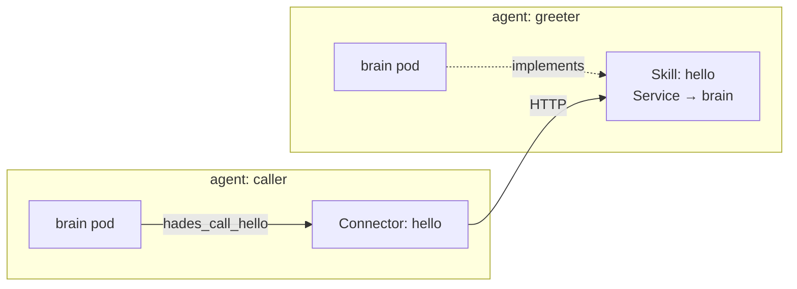

# Tutorial 04 — Publish and consume a Skill

Goal: one agent **exposes** an HTTP capability (a Skill); another agent
**consumes** it (a Connector targeting the Skill's endpoint). This is the
consume↔expose symmetry over plain HTTP. Builds on [01](01-install-on-kind.md).
~10 minutes.

## 1. The symmetry



A `Skill` is what an agent *exposes* (the kernel wires a Service to its brain
pod); a `Connector` is what an agent *consumes*. Both are plain HTTP — the
kernel governs + routes; it never interprets the body.

## 2. Prerequisites

Cluster from [01](01-install-on-kind.md), API on `:7347`. Two agent
namespaces, each with the brain SA:

```bash
for NS in agent-greeter agent-caller; do
  kubectl create namespace "$NS"
  kubectl -n "$NS" create serviceaccount hades-brain
  kubectl -n "$NS" create rolebinding hades-brain --clusterrole=hades-brain --serviceaccount="$NS":hades-brain
done
```

Create the two agents:

```bash
apply() { curl -s -X POST http://127.0.0.1:7347/hades/v1/resources -H 'content-type: application/json' -d "$1" >/dev/null; }

apply '{"apiVersion":"hades.dev/v1alpha1","kind":"Home","metadata":{"namespace":"agent-greeter","name":"g-home"},"spec":{}}'
apply '{"apiVersion":"hades.dev/v1alpha1","kind":"Agent","metadata":{"namespace":"agent-greeter","name":"greeter"},"spec":{"homeRef":"g-home","defaultSession":"g-default","desiredState":"active","brain":{"mode":"test"}}}'

apply '{"apiVersion":"hades.dev/v1alpha1","kind":"Home","metadata":{"namespace":"agent-caller","name":"c-home"},"spec":{}}'
apply '{"apiVersion":"hades.dev/v1alpha1","kind":"Agent","metadata":{"namespace":"agent-caller","name":"caller"},"spec":{"homeRef":"c-home","defaultSession":"c-default","desiredState":"active","brain":{"mode":"test"}}}'

curl -s -X POST http://127.0.0.1:7347/hades/v1/reconcile >/dev/null
```

## 3. Install a skill from the catalog

The in-tree skill catalog lists known installable capabilities. List it:

```bash
curl -s http://127.0.0.1:7347/hades/v1/skills/catalog | jq '.skills[].name'
```

Expected: `["webhook","http-fetch"]`.

Install the `http-fetch` skill onto the greeter — it resolves the catalog entry
into a live `Skill` CRD (the controller routes a Service to the greeter's brain
pod):

```bash
curl -s -X POST http://127.0.0.1:7347/hades/v1/syscalls/install-skill \
    -H 'content-type: application/json' \
    -d '{"subject":{"kind":"Agent","name":"greeter","namespace":"agent-greeter"},"skill":"http-fetch","agentRef":"greeter","namespace":"agent-greeter"}' | jq '.skill.metadata.name'
```

Expected: `"greeter-http-fetch"`.

Reconcile + read the published endpoint:

```bash
curl -s -X POST http://127.0.0.1:7347/hades/v1/reconcile >/dev/null
kubectl -n agent-greeter get skills.hades.dev greeter-http-fetch -o jsonpath='{.status.endpoint}'
```

Expected: `http://skill-greeter-http-fetch.agent-greeter.svc.cluster.local:8080`.

The greeter now *exposes* an HTTP capability cluster-wide.

## 4. Consume the skill from the other agent

Wire a Connector on the caller targeting the greeter's published endpoint:

```bash
curl -s -X POST http://127.0.0.1:7347/hades/v1/resources \
    -H 'content-type: application/json' \
    -d '{"apiVersion":"hades.dev/v1alpha1","kind":"Connector","metadata":{"namespace":"agent-caller","name":"greeter-fetch"},"spec":{"agentRef":"caller","endpoint":"http://skill-greeter-http-fetch.agent-greeter.svc.cluster.local:8080/fetch","egress":"none"}}' >/dev/null
curl -s -X POST http://127.0.0.1:7347/hades/v1/reconcile >/dev/null
```

`egress: "none"` because the call is cluster-internal (a Service) — no
external NetworkPolicy needed. Confirm the connector is ready:

```bash
curl -s "http://127.0.0.1:7347/hades/v1/connectors?namespace=agent-caller" | jq '.[].status'
```

Expected: `{"phase":"ready","reachable":false}` (reachable is false because
egress is `none`, which means "no external egress policy" — the in-cluster
route still works).

## 5. Call the skill

The caller's brain received `HADES_CONNECTORS` with the greeter-fetch
endpoint; its brain-side adapter exposes a `hades_call_greeter-fetch` tool.
Drive the caller (test brain echoes; a real model would invoke the tool):

```bash
curl -s -X POST http://127.0.0.1:7347/hades/v1/agents/caller/message \
    -H 'content-type: application/json' \
    -d '{"namespace":"agent-caller","text":"call the greeter"}' | jq -r .reply
```

Expected: `caller received: call the greeter`.

A real (`pi-sdk`) brain would route the request through the connector tool,
POSTing to the greeter's `/fetch` endpoint over the Service the kernel wired.

## 6. Publish your own skill

Beyond the catalog, an agent with the `publishSkill` capability can expose any
endpoint it implements:

```bash
# Grant the capability:
curl -s -X POST http://127.0.0.1:7347/hades/v1/resources -H 'content-type: application/json' \
  -d '{"apiVersion":"hades.dev/v1alpha1","kind":"CapabilityGrant","metadata":{"namespace":"agent-greeter","name":"g-publish"},"spec":{"subject":{"kind":"Agent","name":"greeter"},"capabilities":["publishSkill"],"constraints":{"namespace":"own"}}}' >/dev/null

# Publish:
curl -s -X POST http://127.0.0.1:7347/hades/v1/syscalls/publish-skill \
    -H 'content-type: application/json' \
    -d '{"subject":{"kind":"Agent","name":"greeter","namespace":"agent-greeter"},"spec":{"name":"echo","port":8080,"path":"/echo","description":"echo back the request"}}' | jq '.kind'
```

Expected: `"Skill"`. The controller wires a `skill-echo` Service; another agent
targets it with a Connector — the same symmetry, no catalog required.

## What you've seen

- A `Skill` is an agent-exposed HTTP capability; the kernel wires a Service.
- A `Connector` is an agent-consumed endpoint; together they form the
  consume↔expose loop over plain HTTP.
- The skill catalog lists known installable skills; `install skill` resolves a
  catalog entry into live resources (govern + discover + route).
- The kernel never interprets a skill body — that's userland (the agent's
  handler / the catalog image).

Back to **[Tutorials](README.md)** · See **[Connectors](../connectors.md)** for
the full capability-boundary reference.
