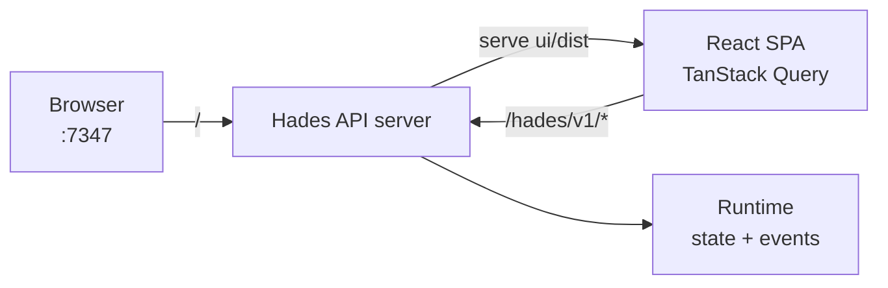

# Web UI

Hades ships a small web console — a React + Tailwind SPA — that mounts on the
API server at `/`. It gives a human a way to **see agents, watch activity, and
spin up a persistent agent attached to an external service** without touching
YAML or `kubectl`.

## Layout

- **Agents** — a table of resident + ephemeral workloads (name, namespace,
  phase, desired state, brain mode). Click a row for a detail drawer with the
  full spec and a "send a message" box.
- **Activity** — the live durable event stream, color-coded by type.
- **Listeners / Schedules / Approvals** — projections of those resources.
- **+ New Agent** — the easy spin-up form (see below).

## The "New Agent" flow

The centerpiece for usability. One form POSTs three resources to the API:

1. a **Home** (durable PVC) — `<name>-home`
2. the **Agent** itself — resident, active, pointing at the home
3. an optional **Listener** bound to Discord / Matrix / CLI

For Discord/Matrix it asks for a `secretRef` pointing at a k8s Secret that
holds the bot token (the controller resolves it on reconcile). After submit it
triggers a reconcile, so the brain pod materializes immediately and the agent
shows up in the table.

## Architecture

| Concern | Choice |
|---|---|
| Framework | React 19 + TypeScript |
| Styling | Tailwind CSS v4 (`@tailwindcss/vite`) |
| Server state | TanStack Query (polls the API every 3s) |
| Routing | React Router (client-side, SPA fallback) |
| Bundle | Vite → `ui/dist`, served statically by the API |

The SPA talks to the same JSON API `hades` CLI and `kubectl`-style tools use —
there is no separate backend. In dev, Vite proxies `/hades` to `:7347` so the
browser origin needs no CORS.

## Serving

The API server serves the built SPA via [`adapters/api/static.ts`](../src/adapters/api/static.ts):

- Paths with a file extension → the asset verbatim (long cache).
- Any other path → `index.html` (SPA client routing works on refresh).
- If `ui/dist` is absent, static serving is a no-op — the API serves normally.

See also: [Control Plane](control-plane.md), [Listeners](listeners.md).
