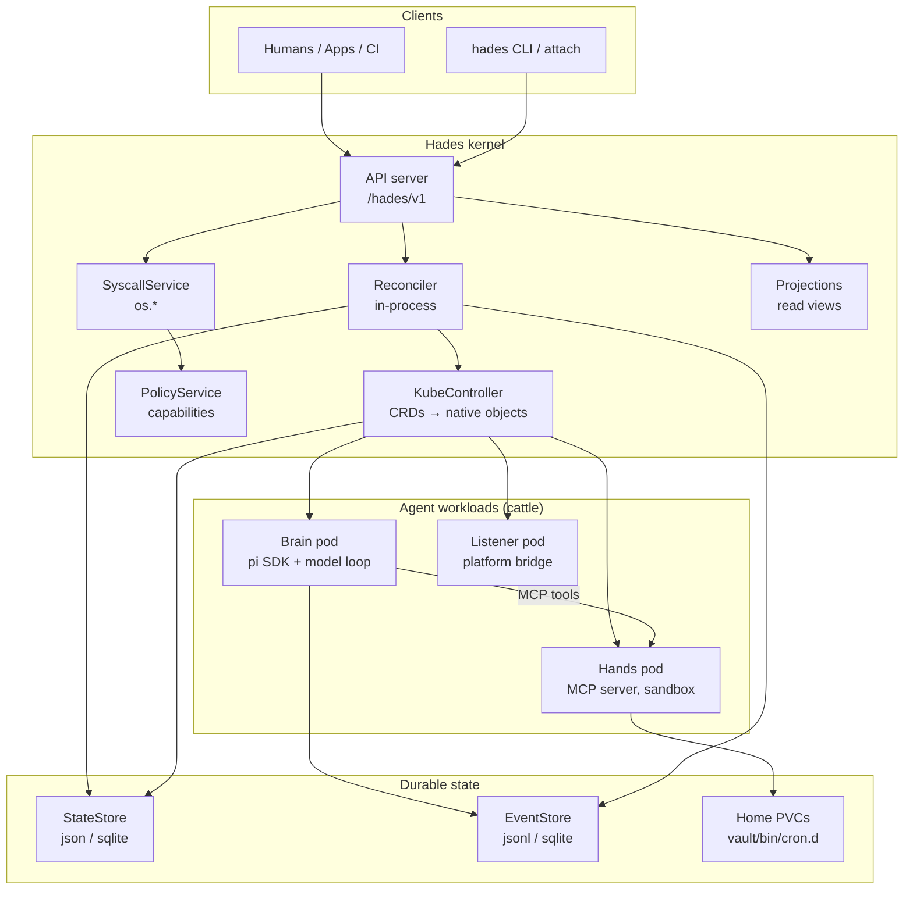

# Hades Spec

Hades is a Kubernetes-native agent operating system. A small kernel supervises
agent workloads — brains, hands, listeners — as disposable pods, while the
durable state (sessions, homes, capabilities) survives every crash.

These specs describe the system as it exists today. Each document is verified
against the codebase; where something is planned but not built, it is marked
**(planned)** and tracked as an issue.

## Documents

- [`01-thesis.md`](01-thesis.md) — what Hades is and what it provides.
- [`02-architecture.md`](02-architecture.md) — the kernel, the two runtimes, and the object graph.
- [`03-resources.md`](03-resources.md) — the custom resources and their schemas.
- [`04-brain-and-session.md`](04-brain-and-session.md) — brain pods, the durable session log, wake/sleep.
- [`05-hands-and-tools.md`](05-hands-and-tools.md) — hands pods, the sandbox ladder, the MCP tool wire.
- [`06-listeners.md`](06-listeners.md) — per-agent I/O devices and the bridge contract.
- [`07-schedules.md`](07-schedules.md) — cron/interval/once timers as first-class resources.
- [`08-control-plane.md`](08-control-plane.md) — the API server, the reconciler, the k8s controller.
- [`09-security.md`](09-security.md) — capabilities, approvals, network policy, credential isolation.
- [`10-syscalls.md`](10-syscalls.md) — the `os.*` capability-checked syscall surface.
- [`11-system-agents.md`](11-system-agents.md) — provisioner, janitor, auditor.
- [`12-projections.md`](12-projections.md) — derived views over durable state and events.

## One-screen architecture

## Hard decisions

1. **Kubernetes is mandatory.** Local dev uses real k8s shape (k3s/kind); there is no bespoke single-process production path.
2. **Hades is a control plane.** The CLI, listeners, and brains are clients or workloads — not the host.
3. **Brains use the pi SDK in-process.** A brain pod embeds an SDK session; it does not spawn an RPC harness inside a sandbox.
4. **Brain and hands are separate.** Model credentials never live in tool sandboxes.
5. **Agents have userland.** Homes are mutable, persistent, agent-owned filesystems.
6. **Listeners are per-agent devices.** An agent may have several; they are not tools.
7. **Schedules are first-class.** Agent-authored timers are part of autonomy.
8. **The session/event log is durable truth.** Context windows and projections are caches.
9. **Self-modification goes through capabilities.** Agents create schedules, tools, listeners, and children only through checked `os.*` syscalls.
10. **The kernel stays boring.** Intelligence belongs in agents; controllers reconcile resources.
