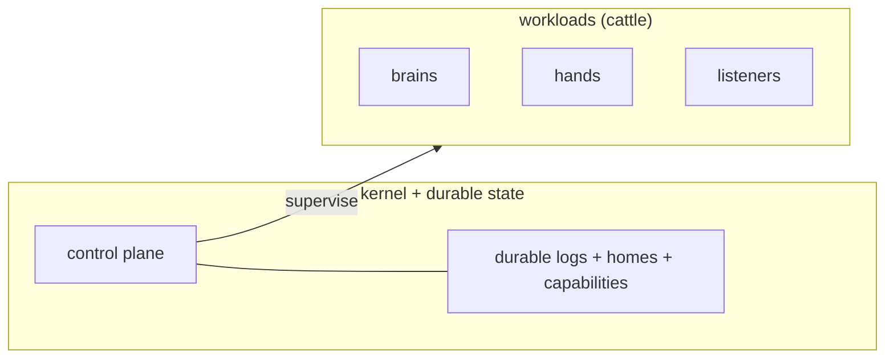
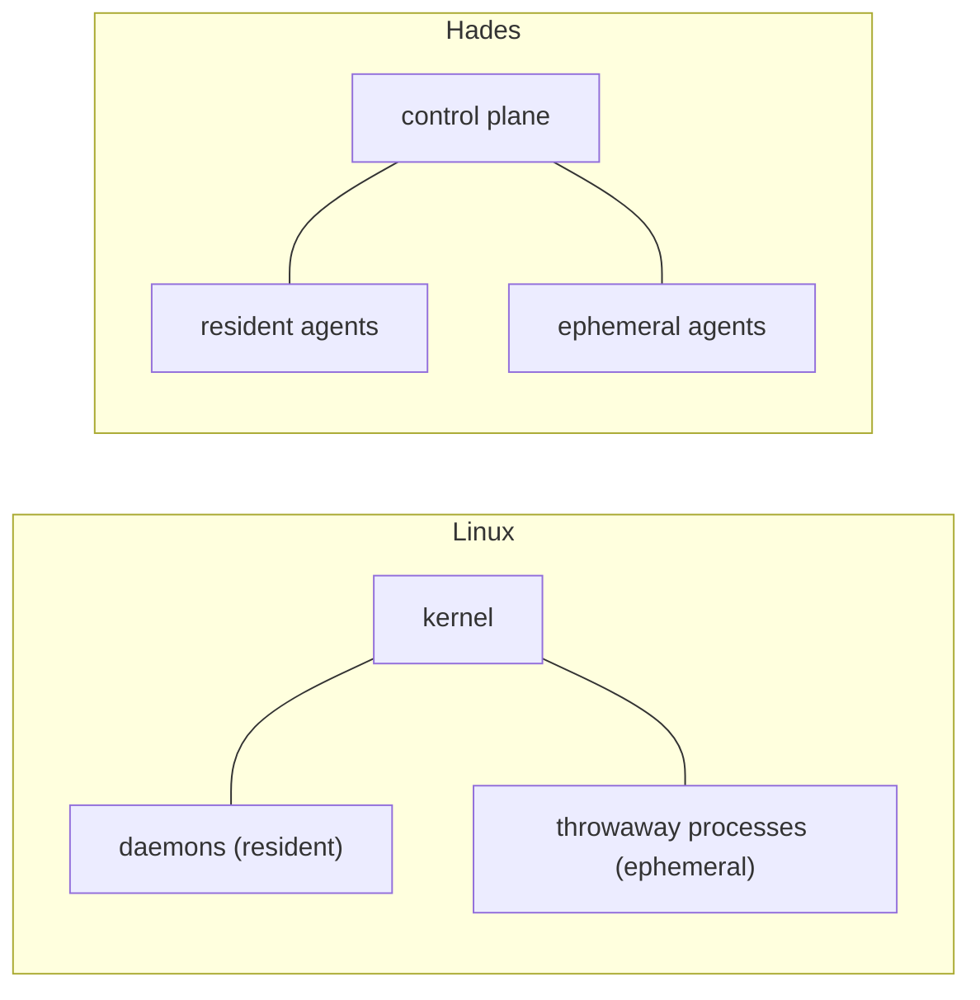

# 01 — Thesis

Hades is a Kubernetes-native agent operating system. A small kernel supervises
agent workloads — brains, hands, listeners — as disposable pods, while durable
state (sessions, homes, capabilities) survives every crash.

## What it is

Agents are managed compute units in a distributed operating system. The kernel
owns the boring, precious things — scheduling, durable session/event logs,
agent Homes, the capability system — and supervises squishy workloads that are
spun up when there is work and killed when idle.



## What it supports

- long-lived **resident agents** and short-lived **ephemeral agents** spawned for one task
- direct human-to-agent and agent-to-agent communication
- per-agent **listeners** (Discord, Matrix, email, web, CLI)
- agent-authored **schedules** and tools
- durable session/event logs
- pi SDK brain execution
- disposable hands/tool pods
- capability-checked self-modification
- system agents that manage the cluster itself

## The OS analogy



A Linux box has one kernel and two kinds of processes: daemons (long-running,
privileged) and throwaway processes (short-lived, confined). Hades is the same
shape, for agents. Only the kernel and durable state are precious; everything
else is cattle — re-created from the durable log on crash.

## Design center

```text
kernel     small control plane: API, controllers, policy, durable logs
userland   agent homes, crons, vaults, tools, projects, skills
hands      disposable execution pods (no model credentials)
listeners  attached devices and bridges
brains     model/harness loops via the pi SDK
```

Tool calls are the right boundary for narrow capabilities (read a file, run a
command, create a schedule). An agent society also needs identity, addressing,
lifecycles, logs, homes, permissions, schedules, listeners, topology, and
supervision — that is what Hades provides.
