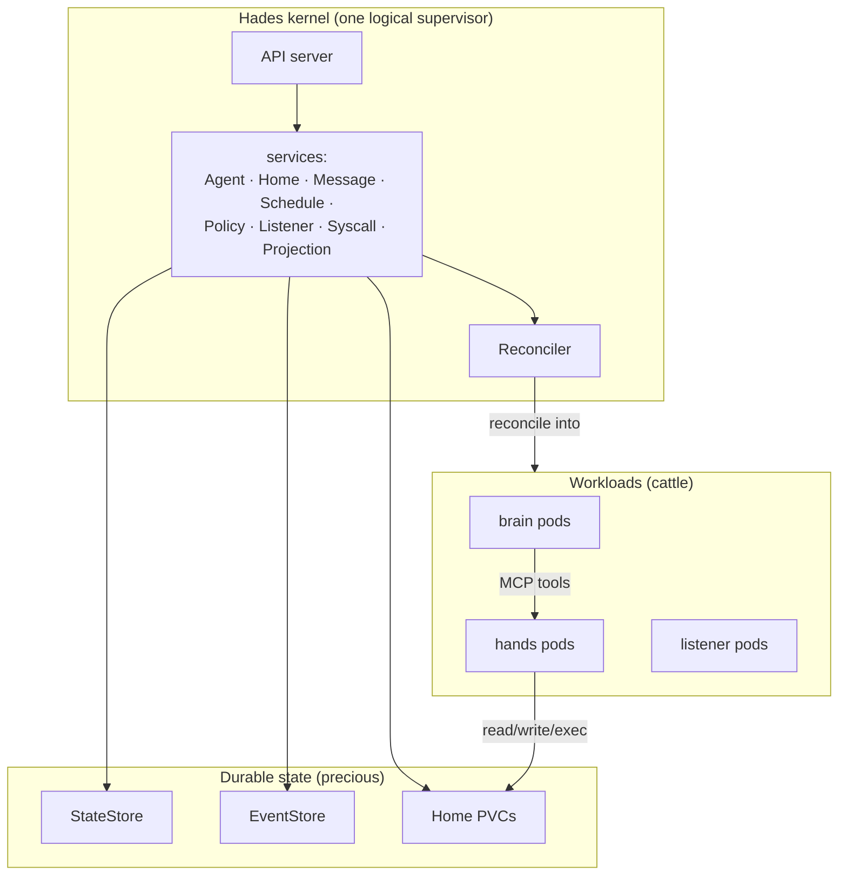
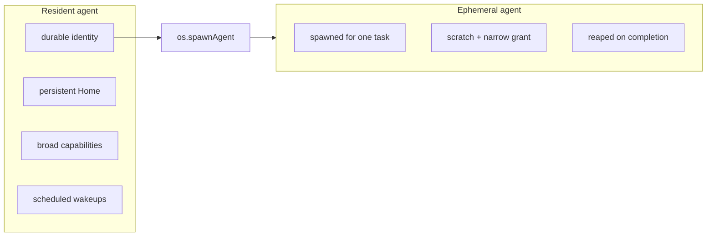
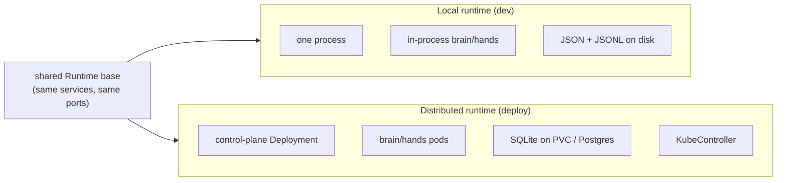
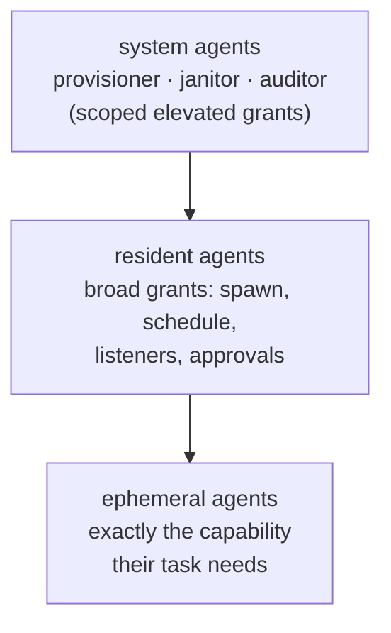

# 02 — Architecture

Hades is a **monolithic agent kernel**: one privileged supervisor with internal
subsystems, supervising squishy agent workloads. Think Linux, not a microkernel
that farms every concern out to a separate server.

## The kernel and its workloads



The kernel subsystems (`AgentService`, `HomeService`, `MessageService`,
`ScheduleService`, `PolicyService`, `ListenerService`, `SyscallService`,
`ProjectionService`) live **inside** the kernel — they are internal modules,
not cooperating microservices. The only things that are separate processes are
the squishy workloads: brains, hands, listeners.

## Resident vs ephemeral



| Linux | Hades |
|-------|-------|
| the kernel | the control plane — API, reconciler, policy, stores |
| kernel subsystems (scheduler, fs, net, caps) | Hades services, in-kernel |
| daemons (long-running, privileged) | **resident agents** — Atlas is one |
| throwaway processes (short-lived, confined) | **ephemeral agents** — a research subagent |
| syscalls (`fork`, `socket`, `read`) | `os.*` capability-checked syscalls |
| device drivers (loadable modules) | listener bridges (Discord/Matrix/CLI) |
| Linux capabilities + seccomp | the capability/permission system |
| per-process home dir / cgroup | **Home** — persistent agent userland |
| driver code in kernel context | **hands** — the sandbox where untrusted code runs |

## Two runtimes, one kernel

The kernel services are mode-agnostic: they depend on **ports**, never on
concrete adapters. Only the substrate differs between the two runtimes:



| Concern | Local | Distributed |
|---------|-------|-------------|
| brain | in-process `PiSdkBrainDriver` | `HttpBrainDriver` → brain pod |
| hands | in-process `LocalConfinedHands` | `McpHandsClient` → hands pod |
| state | `JsonStateStore` | `SqliteStateStore` (Postgres target) |
| events | `JsonlEventStore` | `SqliteEventStore` |
| reconcile | in-process `Reconciler` | + `KubeController` → native k8s objects |

Code written against the `Runtime` services does not change when the workloads
become pods — the ports are the seam.

## The privilege ladder



- A **resident agent** you trust runs with broad grants: `os.spawnAgent`,
  `os.attachListener`, `os.createSchedule`, and — if granted — touch the cluster.
- An **ephemeral agent** runs confined: it gets exactly the capability its
  spawning task needs, a scratch workspace, and is reaped on completion.
- A **system agent** (provisioner/janitor/auditor) is a resident agent with an
  elevated but scoped grant — never blanket cluster-admin.

Granting more is a deliberate, inspectable, revocable act recorded in the event
log — the OS-permission primitive.

## Code shape

```text
src/domain/      resource, event, capability, sandbox, schedule-due, primitives
src/ports/       interfaces: stores, brain driver, hands, kube, listener bridge, policy
src/services/    in-kernel subsystems: Agent/Home/Message/Schedule/Policy/
                 Listener/Reconciler/Syscall/SystemAgents/Projection
src/adapters/    JSON/SQLite stores, pi-SDK + test + HTTP brains,
                 LocalConfined/Container/HTTP/MCP hands, k8s clients, HTTP API
src/runtime/     LocalRuntime + DistributedRuntime (composition roots)
src/controller/  KubeController (CRDs → native k8s objects)
src/brain-pod/   the brain pod HTTP server + CLI
src/hands-pod/   the hands pod MCP server + CLI
```

Subsystems are internal to the kernel, not peer servers — that is the
monolithic choice. Ports exist so `LocalConfinedHands` (in-process, no
isolation) and `ContainerHands` (docker isolation) are the same interface with
different policy.
