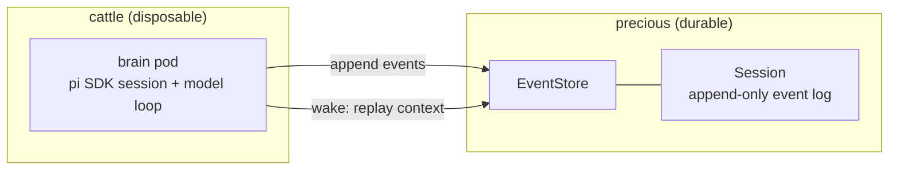
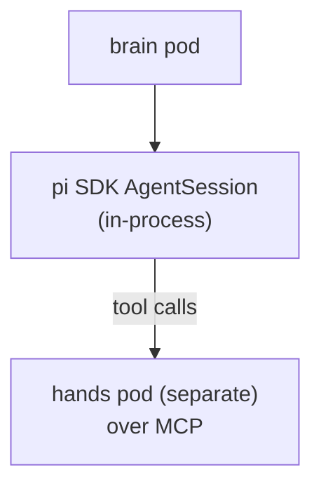
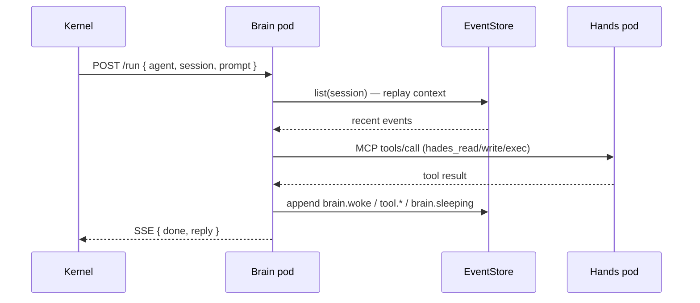
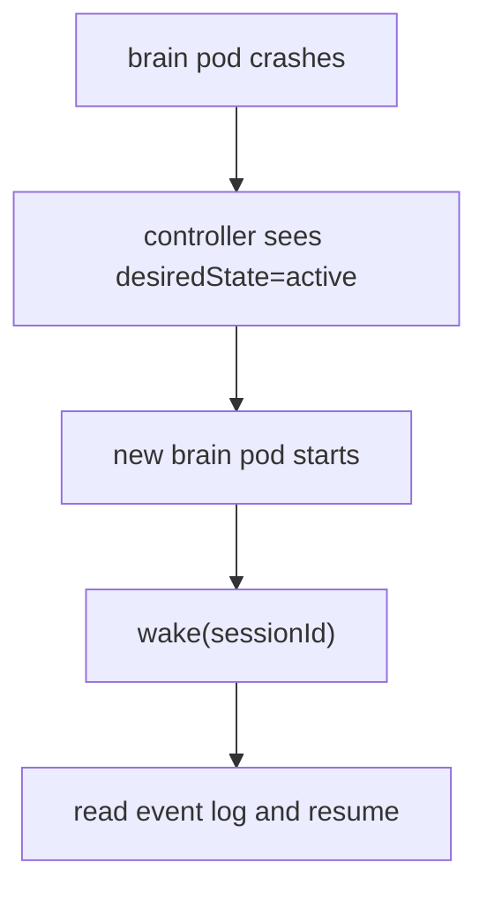

# 04 — Brain and Session

The brain is the model/harness loop. The session is the durable event log.
They are separate concerns: the brain is cattle, the session is precious.

## The split



A brain pod embeds a pi SDK `AgentSession` directly. It does **not** contain a
tool sandbox, a repo checkout, agent home credentials, or session durability —
those belong to hands, the PVC, the secret broker, and the event store
respectively.

## In-process SDK

A brain pod embeds a pi SDK `AgentSession` directly. This gives type-safe
session control, direct model switching, direct compaction, and direct event
subscription. It keeps the brain **out** of the sandbox: the model loop and the
untrusted execution boundary are different pods.



The brain holds no tool sandbox, repo checkout, agent home credentials, or
session durability — those belong to hands, the PVC, the secret broker, and
the event store respectively.

## Wake flow



A message, schedule, or run arrives → the kernel ensures the agent is active →
the brain pod starts with `HADES_SESSION_ID` → the brain replays context from
the event log → it calls the model → tool calls route to the hands pod over MCP
→ events are appended → the brain sleeps.

## Sleep flow

On idle timeout or explicit sleep, the brain waits for model/tool idle, emits
`brain.sleeping(checkpoint=eventId)`, and the pod exits. The agent remains
addressable with no brain pod running.

## Session log

The session log is append-only and queryable. It is **not** the model context
window — the context window is a projection the brain builds by querying
events.

```json
{
  "id": "evt_000128",
  "sessionId": "atlas-default",
  "type": "tool.completed",
  "createdAt": "2026-06-26T07:00:00Z",
  "payload": { "tool": "hades_exec", "ok": true, "summary": "wrote vault/note.md" }
}
```

Event types in use today:

```text
resource.applied            listener.connected
agent.spawned               listener.message.received
agent.reaped                brain.woke
agent.reconciled           brain.sleeping
home.reconciled            brain.model.completed
home.file.written          brain.failed
hands.reconciled            tool.completed
schedule.fired             tool.failed
schedule.failed            approval.requested
schedule.reconciled        approval.responded
syscall.audited             artifact.emitted
system-agent.created       system-agent.granted
```

## Brain failure



Failure of a brain is not failure of the agent. The durable session log is the
source of truth; the brain is reconstructed from it.

## Model configuration

Model credentials live in brain pod configuration (a Kubernetes `Secret`
mounted via `envFrom`), never inside hands. The brain resolves providers/models
through the pi SDK's configured auth; Hades does not special-case any provider.
