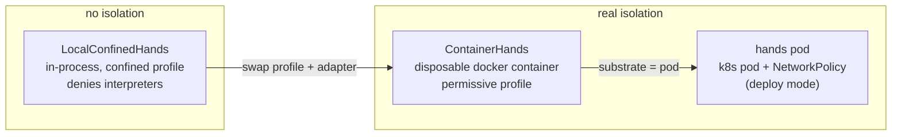
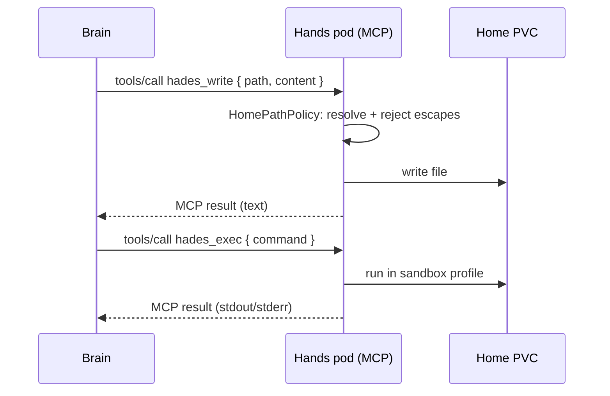
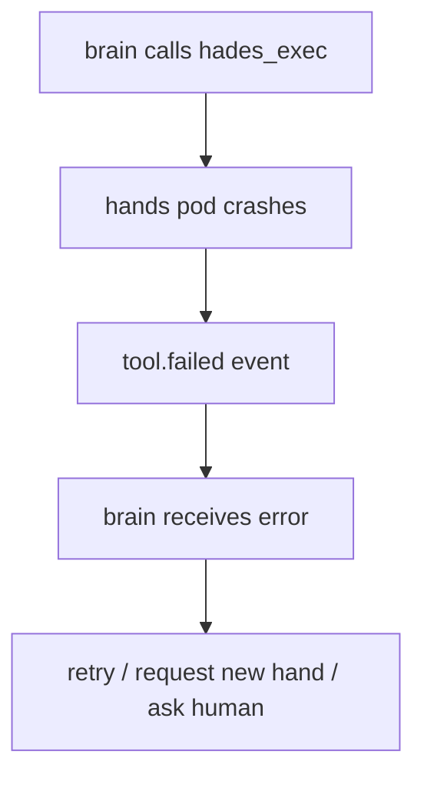

# 05 — Hands and Tools

Hands are execution environments. Tools are the syscalls brains use to affect
the world. Hands pods are disposable; they hold no model credentials.

## The sandbox ladder



The sandbox **profile** is the policy; the **backend adapter** is the
substrate. Swapping `LocalConfinedHands` for `ContainerHands` changes the
isolation boundary without touching the brain, the parser, or the wire.

| Profile | Interpreters | Shell metachars | Used by |
|---------|--------------|-----------------|---------|
| `confined-local` | denied | denied | `LocalConfinedHands` (no isolation) |
| `permissive-container` | allowed | allowed | `ContainerHands`, hands pod (real isolation) |

A confined profile refuses interpreters because there is no real boundary to
contain them. A container-backed profile allows them because the container
*is* the boundary — exactly the model docker/modal/e2b sandboxes use.

## Tool call flow



The brain sees a normal tool result. The system sees every call as a durable
event. Tool errors surface as MCP rejections so confinement holds over the
wire.

## The MCP wire

The brain→hands wire is **MCP Streamable HTTP** — the standards-aligned
single-endpoint JSON-RPC-over-HTTP-with-SSE protocol. The hands pod exposes
three tools:

| Tool | Maps to |
|------|---------|
| `hades_read(path)` | `HandsBackend.read` |
| `hades_write(path, content)` | `HandsBackend.write` |
| `hades_exec(command, cwd?)` | `HandsBackend.exec` |

The hands pod runs **stateless** (no session ID): each tool call is
independent, which suits disposable hands. A fresh MCP transport is created
per request (the stateless contract requires it).

A plain-HTTP `HttpHandsClient` exists as a fallback for environments without
the MCP SDK, but `McpHandsClient` is the default.

## Filesystem policy

```text
home:              read-write for the owner hands pod
home path policy:  rejects absolute paths, .. traversal, symlink escapes
model credentials: never mounted into hands (token isolation)
kernel secrets:    never mounted into hands
```

The `HomePathPolicy` enforces home-relative paths regardless of substrate —
path escapes are refused in every hands backend.

## Hands failure



A hands crash becomes a tool error, not agent death. The brain may retry,
request a new hand, ask a human, or continue.

## Home-backed tools

Agents may keep executable tools in their Home (`bin/`). This is normal
userland. Execution routes through hands:

```text
agent writes ~/bin/foo
agent calls hades_exec("foo ...")
Hades routes to the hands pod
hands executes ~/bin/foo under the sandbox profile
result returns through the event log
```

Creating a tool in the home is a filesystem write; *granting* it broad
privilege is a separate, capability-gated act.
