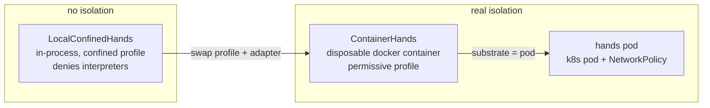
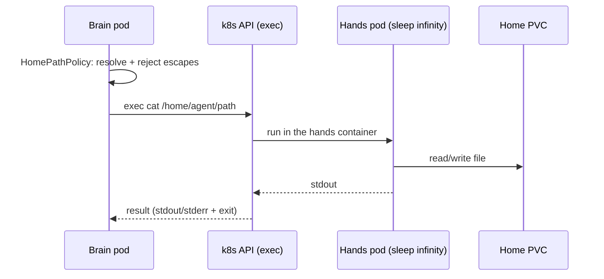
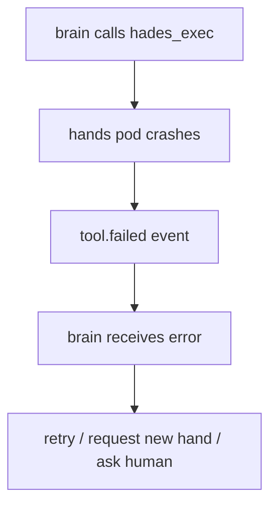

# 05 — Hands and Tools

Hands are execution environments. Tools are the syscalls brains use to affect
the world. Hands pods are disposable; they hold no model credentials.

## The sandbox ladder



The sandbox **profile** is the policy; the **backend adapter** is the
substrate. Swapping `LocalConfinedHands` for `ContainerHands` changes the
isolation boundary without touching the brain, the parser, or the wire.

| Profile | Interpreters | Shell metachars | Used by |
|---------|--------------|-----------------|---------|
| `confined-local` | denied | denied | `LocalConfinedHands` (no isolation) |
| `permissive-container` | allowed | allowed | `ContainerHands`, hands pod (real isolation) |

A confined profile refuses interpreters because there is no real boundary to
contain them. A container-backed profile allows them because the container
*is* the boundary — exactly the model docker/modal/e2b sandboxes use.

## Tool call flow



The brain sees a normal tool result. The system sees every call as a durable
event. The home path policy is enforced client-side before any exec reaches
the pod, so confinement holds regardless of substrate.

## The brain→hands wire

The brain reaches the hands pod via the **Kubernetes exec API** — the brain
pod's in-cluster ServiceAccount execs `cat`/`sh`/`dd` into the hands
container. The hands pod runs `sleep infinity`; it is a thin sandbox with the
Home mounted at `/home/agent`. There is no tool server in the pod — the brain
drives all execution via exec (`PodHandsBackend`).

The `HandsBackend` port is the seam. Alternate wires exist as adapters behind
it:

| Adapter | Wire | Use |
|---------|------|-----|
| `PodHandsBackend` | k8s exec | live cluster (default) |
| `LocalConfinedHands` | in-process fs | test substrate |
| `ContainerHands` | docker container | dev real-isolation hands |
| `McpHandsClient` | MCP Streamable HTTP | alternate (a hands pod running the MCP server) |

The hands pod exposes three operations mapped onto `HandsBackend`:
`hades_read`, `hades_write`, `hades_exec`.

## Filesystem policy

```text
home:              read-write for the owner hands pod
home path policy:  rejects absolute paths, .. traversal, symlink escapes
model credentials: never mounted into hands (token isolation)
kernel secrets:    never mounted into hands
```

The `HomePathPolicy` enforces home-relative paths regardless of substrate —
path escapes are refused in every hands backend.

## Hands failure



A hands crash becomes a tool error, not agent death. The brain may retry,
request a new hand, ask a human, or continue.

## Home-backed tools

Agents may keep executable tools in their Home (`bin/`). This is normal
userland. Execution routes through hands:

```text
agent writes ~/bin/foo
agent calls hades_exec("foo ...")
Hades routes to the hands pod
hands executes ~/bin/foo under the sandbox profile
result returns through the event log
```

Creating a tool in the home is a filesystem write; *granting* it broad
privilege is a separate, capability-gated act.
