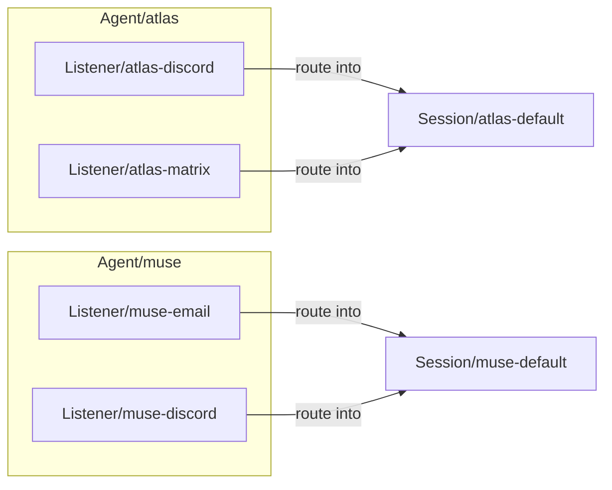
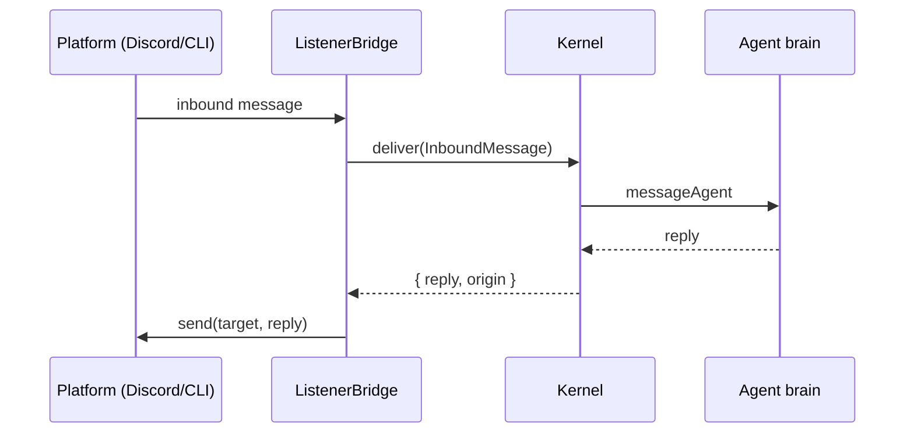

# 06 — Listeners

Listeners are per-agent I/O devices: Discord, Matrix, email, web, CLI. They are
**not** tools — they are the channels through which an agent talks to the world.

```text
Listener = terminal / network device / mailbox
Tool     = action capability / syscall
```

## Per-agent attachment



An agent may have several listeners; each is a declared `Listener` resource.
Multiple listeners can fan-in to one session.

## The bridge contract

Every platform bridge satisfies the `ListenerBridge` port:



The bridge receives inbound messages and routes them to the agent's session;
replies default to the inbound origin (stored in the event log so brain
restarts do not lose the routing path).

## Inbound message shape

```json
{
  "listenerRef": "atlas-discord",
  "agentRef": "atlas",
  "sessionRef": "atlas-default",
  "origin": {
    "platform": "discord",
    "channel": "1333841182794580112",
    "sender": "river",
    "thread": null
  },
  "content": "good morning"
}
```

## Platforms today

| Platform | Status |
|----------|--------|
| `cli` | **Real** — `CliBridge`, used by `hades attach <agent>` for a kernel console. |
| `discord` / `matrix` / `email` / `web` | Declared resources; the bridge SDKs are not wired. They fail loudly on start until the adapter is added. The resource model and routing exist; the SDK is the only missing piece. |

Listener pods are cattle: if a bridge crashes, the agent and session persist.
The bridge is a thin adapter that turns platform events into Hades
`listener.message.received` events and routes brain replies back.

## Direct agent chat

The Hades API can bypass external bridges — a kernel console attached directly
to the agent:

```text
POST /hades/v1/agents/{agent}/message
```

`hades attach <agent>` is the CLI form of this, using the `CliBridge`.
