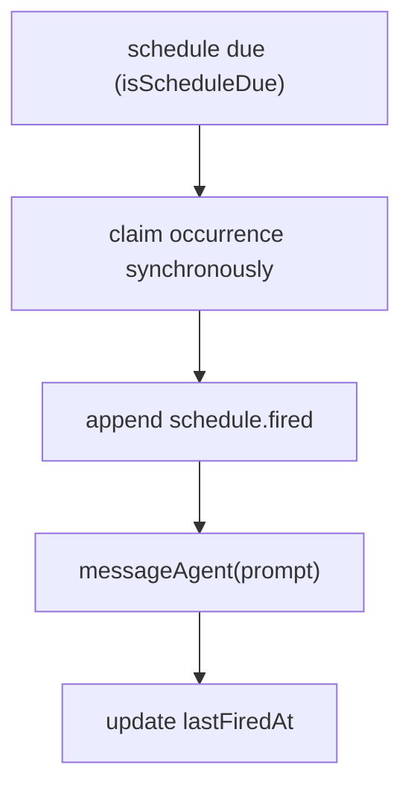

# 07 — Schedules

Schedules are first-class resources: timers that inject a prompt into an
agent. They are kernel-owned and agent-authorable through the
`os.createSchedule` syscall.

## Schedule types

| Type | `schedule` value | Behavior |
|------|------------------|----------|
| `once` | ISO timestamp, or `+Ns/m/h` relative to creation | Fires once. |
| `interval` | `+Ns/m/h` | Recurring, every N units from the last fire. |
| `cron` | 5-field Vixie expression | Recurring, current-minute match. |

A malformed schedule is marked `invalid` and skipped without crashing the
reconcile loop. A transient delivery failure emits `schedule.failed` and leaves
the schedule active to retry. Concurrent reconciles cannot double-fire — the
occurrence is claimed synchronously before the await.

## Execution flow

## Substrate

In local mode, schedules fire in-process via `croner`. In distributed mode,
cron/interval schedules reconcile to a Kubernetes `CronJob` (`sched-<name>`)
that triggers the agent; `once` schedules are delivered in-process by the
kernel.

## Agent-authored schedules

A resident agent with the `createOwnSchedule` capability may create or modify
its own schedules. Changes are validated, audited (`syscall.audited`), and
namespace-confined. This is autonomy with visibility — the kernel records every
self-modification.

## Home as schedule source

Schedule prompt bodies may live in the agent Home (`cron.d/*.md`), referenced
via `promptRef.homePath`, or inline as `prompt`. Home files are editable
userland; the Schedule resource is the executable desired state.
