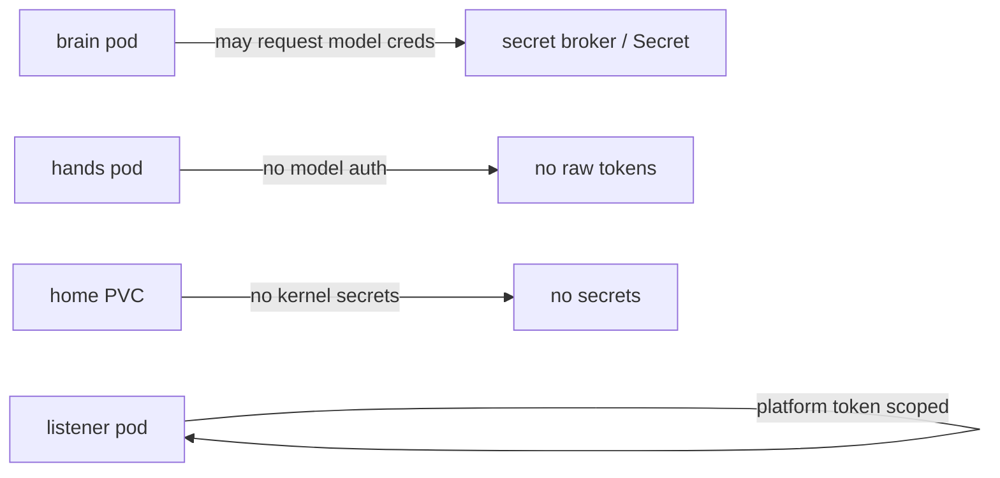
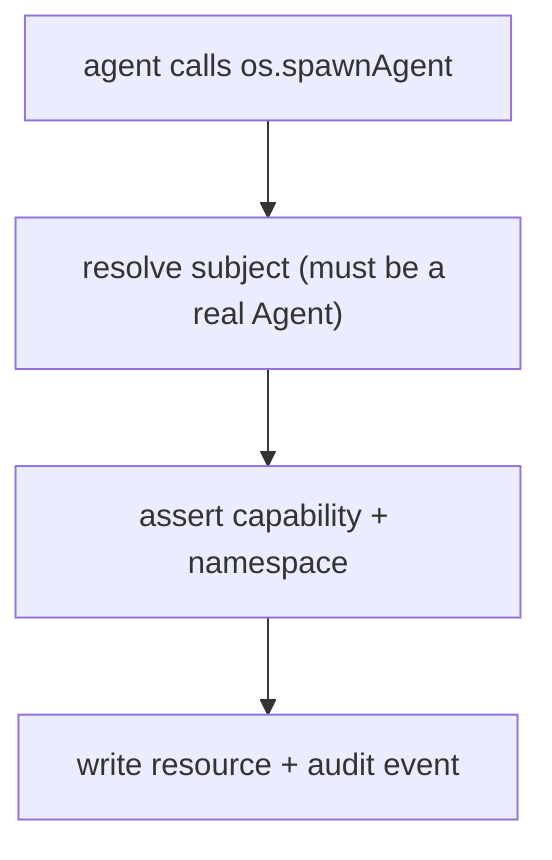
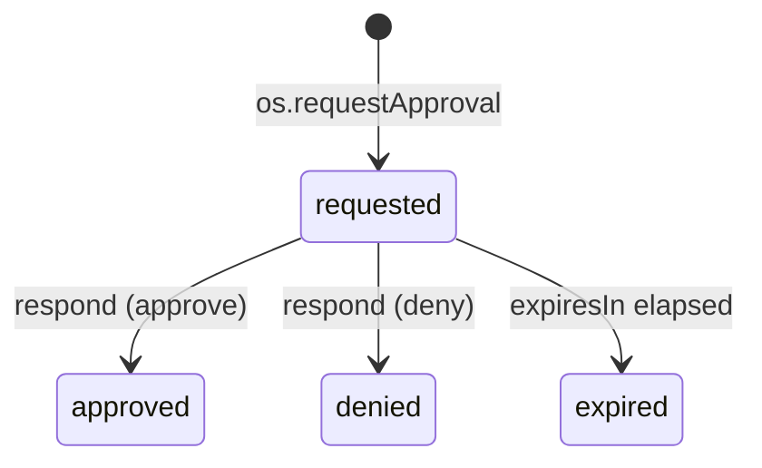
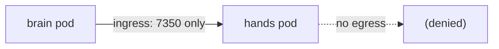

# 09 — Security

Hades preserves self-modification while keeping prompt injection from becoming
cluster-admin. The mechanism is capabilities + credential isolation + network
policy + audited, resumable approvals.

## Credential boundary



| Surface | Credentials |
|---------|-------------|
| brain pod | may request model/API credentials through the SDK / broker |
| hands pod | no model auth, no raw provider tokens |
| home PVC | no kernel secrets |
| listener pod | platform token scoped to the listener |

Model credentials are mounted into the brain pod as a `Secret` via `envFrom`,
never into hands.

## Capabilities

Capabilities are typed permissions above raw Kubernetes RBAC. A `CapabilityGrant`
gives a subject (agent, human, system agent) a set of capabilities with
constraints. Every syscall and tool route checks: subject identity, requested
capability, resource ownership, namespace boundary, and audit requirement.



Granting more capability is a deliberate, inspectable, revocable act recorded in
the event log.

## Approvals

Approvals are resumable gates for destructive or privileged operations. An
agent calls `os.requestApproval`; the human (or an authorized agent) responds
with `approve`/`deny`; the calling run may await resolution.



## Network policy

Hands pods use default-deny egress with explicit profiles. The controller
stamps a `NetworkPolicy` on each hands pod: only the brain pod for that agent
may reach it (ingress), and there is no egress by default.



## Filesystem policy

```text
home:                  read-write for the owner hands pod
home path policy:      rejects absolute paths, .. traversal, symlink escapes
kernel agent dir:      never mounted into hands
secrets:               projected only into the brain pod where required
```

## Audit

Every syscall appends a `syscall.audited` event: who requested, what capability,
which resource, and the policy decision. Audit events are durable and
queryable via projections.

## System agents

System agents receive elevated **but scoped** capabilities, never blanket
cluster-admin. See [`11-system-agents.md`](11-system-agents.md).

## Principle

Agents may grow their userland. They may not silently mutate the kernel or
escape their capability domain.
