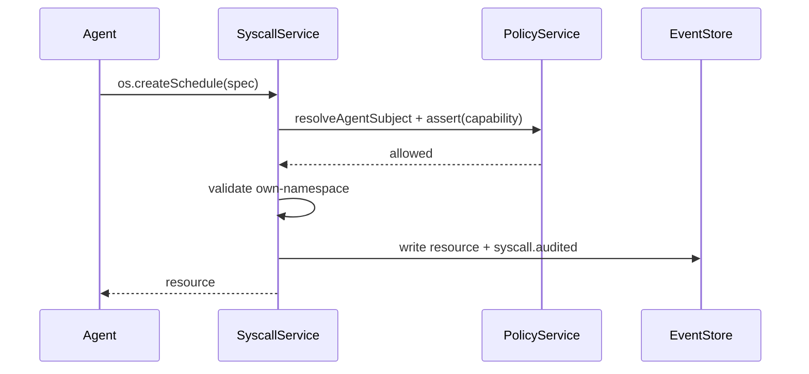
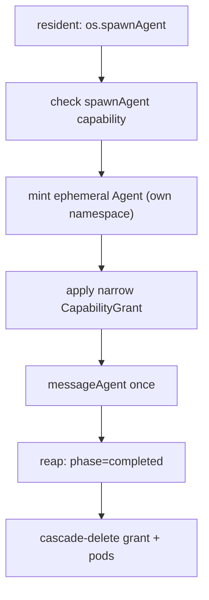

# 10 — Syscalls

Agents do not patch raw Kubernetes YAML. They call typed Hades syscalls that
validate capabilities, enforce namespace boundaries, and write resources +
audit events. This is the `os.*` surface — the resident agent's main
programming model.

## Flow



Each syscall:

1. resolves the calling subject (must be a real `Agent`)
2. asserts the required capability
3. validates namespace boundaries (cannot target another namespace)
4. writes the resource + appends an audit event

## Syscall surface

| Syscall | Capability | Effect |
|---------|------------|--------|
| `createSchedule` | `createOwnSchedule` | Create a cron/interval/once timer. |
| `spawnAgent` | `spawnAgent` | Mint a confined ephemeral worker; run once; reap. |
| `createAgent` | `createAgent` | Mint a new (usually resident) agent. |
| `createHome` | `createHome` | Provision a home PVC for an agent. |
| `attachListener` | `attachListener` | Attach a platform listener to an agent. |
| `requestApproval` | `requestApproval` | Create a resumable human-in-the-loop gate. |
| `respondApproval` | `respondApproval` | Approve/deny a pending approval. |
| `emitArtifact` | `emitArtifact` | Record an artifact reference in the event log. |

`permittedSyscalls(subject)` introspects which syscalls an agent may currently
make.

## spawnAgent = fork



A spawned agent is a real `Agent` resource with `lifecycle: ephemeral`, an own
session, and a narrow grant. It runs its prompt once and is reaped. In
distributed mode the ephemeral becomes a real pod; the controller cascades
brain/hands pod deletion via `ownerReferences`. Ephemeral agents get no
capabilities by default; the spawner may grant a narrow subset.

## API endpoints

```text
POST /hades/v1/syscalls/schedules          createSchedule
POST /hades/v1/syscalls/spawn-agent         spawnAgent
POST /hades/v1/syscalls/create-agent        createAgent
POST /hades/v1/syscalls/create-home          createHome
POST /hades/v1/syscalls/attach-listener      attachListener
POST /hades/v1/syscalls/request-approval     requestApproval
POST /hades/v1/syscalls/respond-approval      respondApproval
POST /hades/v1/syscalls/emit-artifact        emitArtifact
GET  /hades/v1/syscalls/permitted?name=&namespace=  permittedSyscalls
```

## Capability catalog

```text
createOwnSchedule    spawnAgent          createAgent
createHome           attachListener      requestApproval
respondApproval      emitArtifact        messageAgent
deleteExpiredHands   deleteExpiredRuns   listResources
readPolicy           readAuditEvents     createFinding
```

Capabilities are granted via `CapabilityGrant` resources with constraints
(e.g. `namespace: own`). The `messageAgent` capability gates direct messaging.
System agents use the `deleteExpired*`, `readPolicy`, and `createFinding`
capabilities (see [`11-system-agents.md`](11-system-agents.md)).
