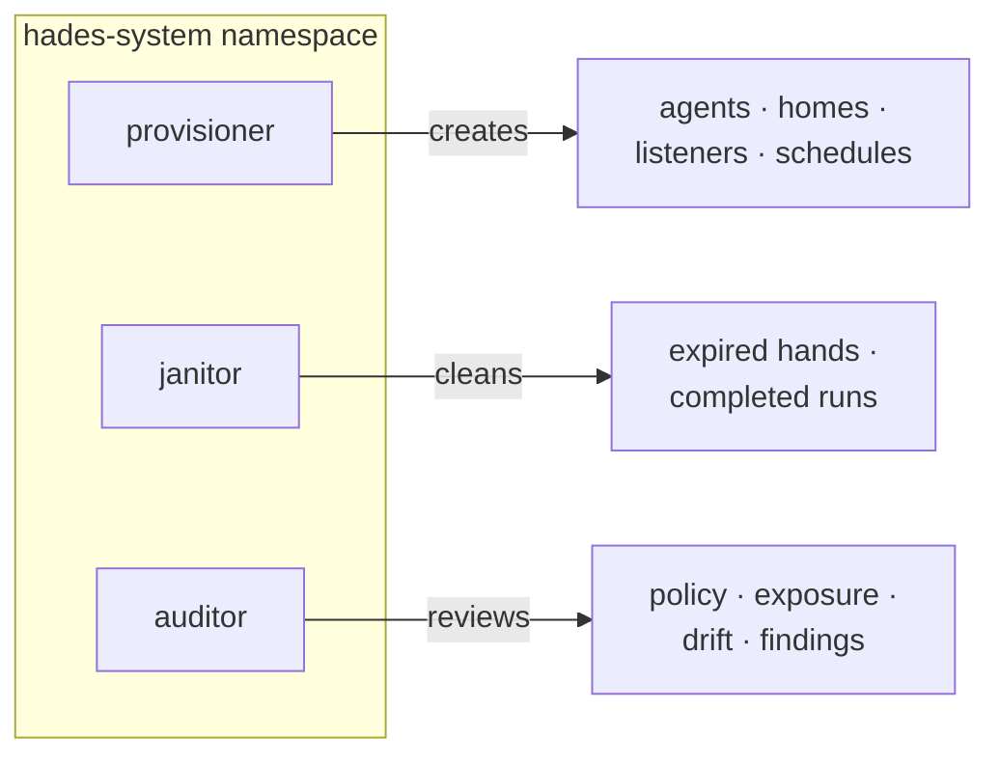
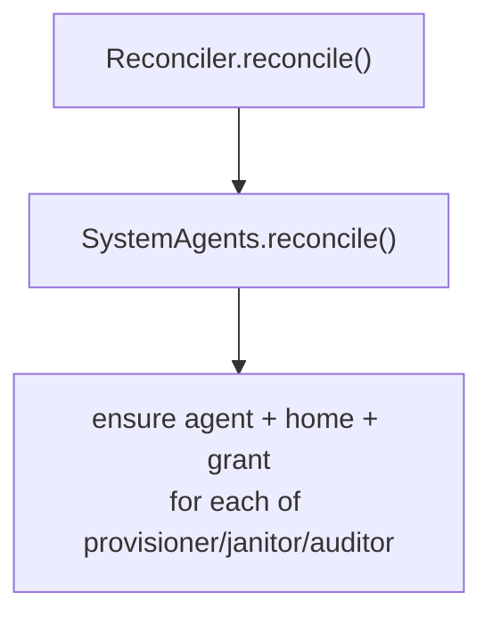

# 11 — System Agents

System agents are privileged userland daemons that manage Hades. They are
agents with elevated (but scoped) capabilities — never blanket cluster-admin.

## The design rule

```text
if a behavior requires judgment          -> system agent (privileged userland)
if a behavior requires deterministic     -> controller (boring reconciler)
   desired-state convergence
```

The `KubeController` is the deterministic reconciler. System agents are the
intelligent operators on top: they call the same `os.*` syscalls ordinary
agents do, but with broader grants.

## The three system agents



| Agent | Capabilities | Role |
|-------|--------------|------|
| `provisioner` | `createAgent`, `createHome`, `attachListener`, `createOwnSchedule`, `spawnAgent` | Creates ordinary agents, homes, listeners, and schedules from requests. |
| `janitor` | `deleteExpiredHands`, `deleteExpiredRuns`, `listResources`, `emitArtifact` | Cleans expired hands, completed runs, orphaned resources. |
| `auditor` | `readPolicy`, `listResources`, `emitArtifact`, `requestApproval` | Reviews capabilities, secrets, exposure, drift; surfaces findings. |

## Bootstrapping

`SystemAgents.reconcile()` is idempotent: it ensures the three agents, their
homes, and their scoped grants exist in the `hades-system` namespace. Their
actual intelligence runs in brain pods like any agent; this only bootstraps the
resources and grants.



## Recursive agents

Any agent with `spawnAgent` may spawn child agents if policy permits. A
resident agent spawning a helper is process spawning, not hidden tool
execution — the child is a real, inspectable `Agent` resource.
